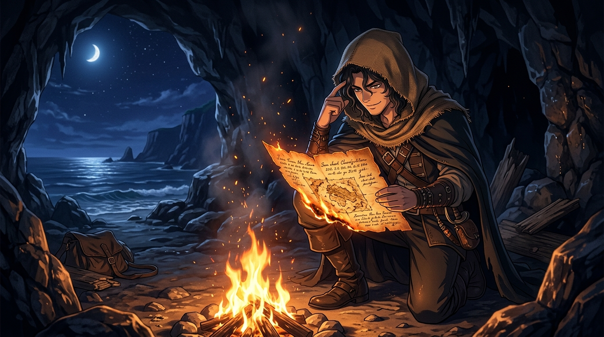

# 🖼️ 火光中的活體密碼 (Living Cipher in the Embers)

## 創作感悟與理念

本作靈感源自《黑帆》（series-black-sails）第一季第 4 話最核心的戲劇質變與情報反轉：

在拿騷這片由謊言與殺戮構築的荒沙上，各方梟雄——鐵血船長弗林特、暴戾兇徒韋恩、野心勃勃的加斯里家族——為了尋得西班牙寶船「烏爾卡·德·利馬號（Urca de Lima）」的航線日程表，展開了無休止的流血爭奪與刑求。

然而，偷走海圖的見習廚子約翰·席爾瓦（John Silver）在暗夜的火堆前做出了最極端也最狡黠的決斷：

> 「我不確定自己能逃過你和那個瘋子的追捕……於是為了生存，我採取了極端措施。——你的日程表，現在全在這裡（手指太陽穴）。」

他當著眾人的面將這張價值五百萬銀幣的珍貴手稿引燃投入火堆，親手將一件「誰都能搶奪、比對、偽造並殺人滅口」的**物理紙頁**，徹底焚化為「誰殺了誰就得破產、唯一存在於個人大腦中」的**活體保險箱**。殺了他等於親手鑿沉整座浮動寶庫；留著他，他便成了全島最尊貴也最動不得的活財神。

畫面中，青年海盜裹著麻布斗篷半跪在岩洞篝火旁，泛黃海圖下緣正被赤金火苗舔舐燃燒，火星伴著夜風飄散進深邃的加勒比海夜空。他神情從容而狡黠地以指尖輕點太陽穴——那一刻，紙頁化作灰燼，而生存的傳奇以肉身之軀正式啟航。

