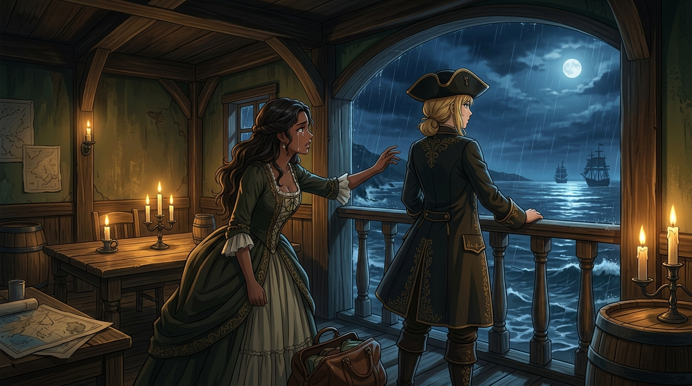

# 🖼️ 荒沙之島與燃淚之誓 (Sand Island and the Unrequited Vow)

## 創作感悟與理念

本作靈感源自《黑帆》（series-black-sails）第一季第 4 話中最令人心碎的感情與理想碰撞：

在充斥著背叛與血腥的妓院密室內，麥克斯（Max）收拾好皮箱，滿眼含淚卻無比深情地向埃莉諾·加斯里（Eleanor Guthrie）做出最後的告白與挽留：

> 「埃莉諾，看著我……這裡只是一片荒沙，它永遠無法回應妳的愛意（This place is just sand. It cannot love you back.）。但只要妳跟我走，我永遠、永遠都不會離開妳。」

然而，埃莉諾的心中早已被弗林特的戰火、五百萬銀幣的寶藏以及整座拿騷的秩序王國所佔據。她轉過身，背對著這份真摯熾熱的愛，冷漠地望向窗外夜色洶湧、帆影林立的冷冽大海。

麥克斯看透了這座島嶼的本質——它是一座吞噬一切善良與溫存的絞刑架；但埃莉諾卻甘願以身入局，甚至不惜犧牲摯愛，將自己推向孤家寡人的萬丈深淵。

畫面捕捉了燭光搖曳的木屋迴廊：淚水在麥克斯美麗而決絕的眼眸中閃爍，她伸出的手掌懸在半空；而身著海盜商裝的埃莉諾駐足於露台前，冷月與海風吹拂著她的金髮，兩人之間隔著一道無法跨越的命運鴻溝。

