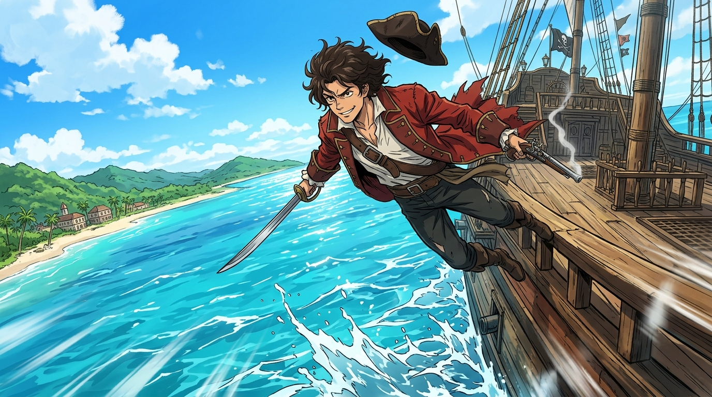

# 🖼️ 席爾瓦的生死一躍 (John Silver's Leap into the Blue)

## 創作感悟與理念

本作靈感源自《黑帆》（series-black-sails）第一季第 3 話中約翰·席爾瓦（John Silver）在海象號上的驚險逃脫名場面。

當大副蓋茨、比利與全體軍官在船艙內以排除法逐步收攏小偷的搜查網時，全船唯一算出自己即將暴露的人就是席爾瓦。在所有人都以為跳海是發瘋、水手們嘲弄他「大概只是急著上岸找女人」之際，席爾瓦卻毫不猶豫地爬上高聳的船舷，在烈日下縱身躍入加勒比海的萬頃碧波之中。

這不是衝動，而是頂級投機者在封閉牢籠中計算出的唯一止損解。他不按任何海盜法典或海軍規矩出牌，帶著藏在靴子裡的西班牙寶船航程表，以肉身泅渡撕開了海象號的搜捕天網，直奔拿騷市集尋找變現離場的支點。

畫面採動漫熱血關鍵幀動態構圖，加勒比海明艷的蔚藍晴空與翻滾白浪交織。席爾瓦以英氣而狡黠的笑容凌空飛躍，海風吹起他的風衣與三角帽，陽光在水花與劍刃上閃爍，展現出底層生存者不屈於任何秩序的野生生命力。

