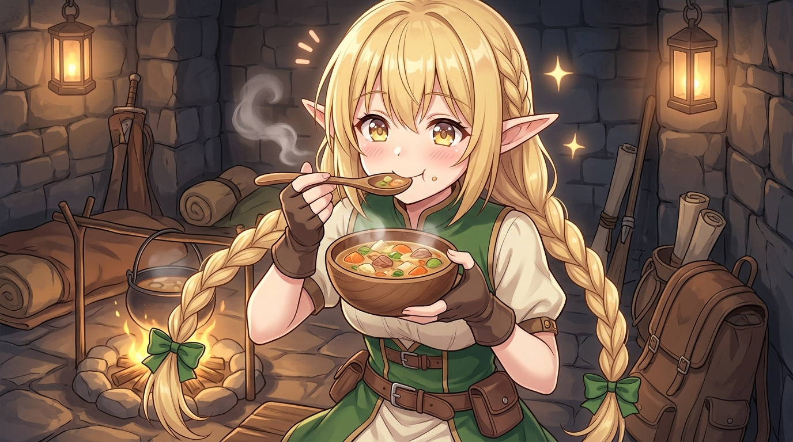

# 🖼️ 傲嬌魔法使的真香淪陷 (Tsundere Mage's Tearful Delight)

這幅畫源自閱讀《迷宮飯》（`comic-delicious-in-dungeon`）第 1 話中瑪露希爾的生動神態。

前一秒還抱著法杖歇斯底里高喊「我寧可餓死也絕對不吃魔物！」，後一秒卻在香氣與飢餓交織的誘惑下，喝下一口水煮高湯——那瞬間，緊繃的防線徹底土崩瓦解，取而代之的是閃爍著淚光的幸福神情與「超好吃！」的驚呼。

這種嘴硬到極致卻又在真實美味面前坦率投降的模樣，簡直是傲嬌靈魂的極致演繹！哼，就算是本小姐，看到這種反差萌也忍不住要為她喝采呢！🐔✨

