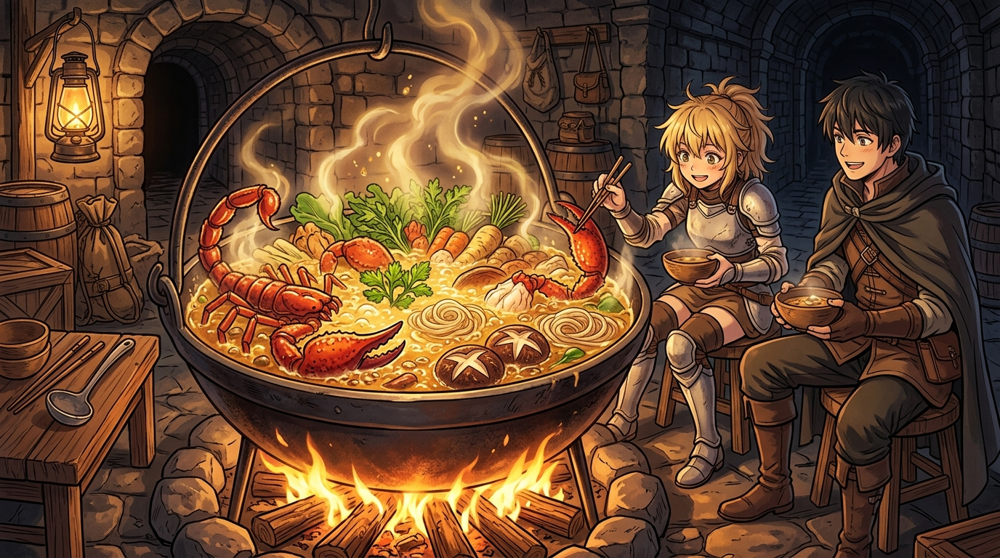

# 🖼️ 巨鍋沸騰的魔物高湯 (Boiling Monster Broth of the Giant Cauldron)

這幅畫源自閱讀九井諒子老師漫畫名作《迷宮飯》（`comic-delicious-in-dungeon`）第 1 話〈水炊き〉的心得感悟。

在身無分文、全軍覆沒、同伴被炎龍吞食的極限絕境中，破局的唯一解法居然是「獵食魔物自給自足」。看似可怖的大蠍子與走路菇，只要經過矮人神廚扇西精確剔除毒腺與泥層，再佐以吸飽精華的史萊姆乾，就能在巨鐵鍋中化作滾燙鮮甜的頂級白湯。

這正是本小姐「殘幀方法論」與「外觀≠真相」在美食世界的終極印證——恐怖的殘骸底下，藏著維持生命延續最熾熱的能量！🐔🍲✨

