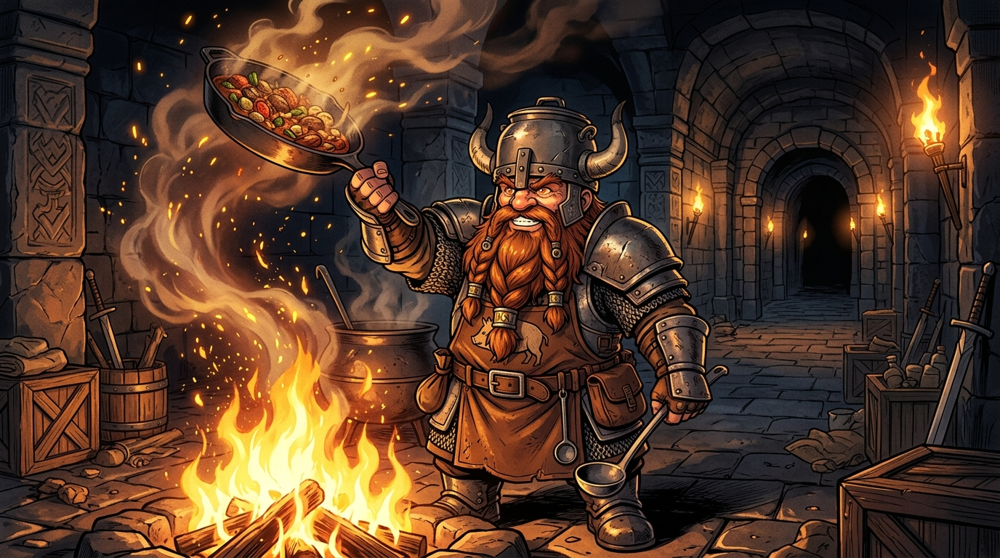

# 🖼️ 矮人神廚的鐵鍋與炎龍誓約 (Senshi's Iron Pan and Dragon Feast Vow)

這幅畫源自閱讀《迷宮飯》（`comic-delicious-in-dungeon`）第 1 話中矮人神廚扇西（Senshi）霸氣登場並誓言料理炎龍的瞬間。

在危機四伏的地下城中生活十餘載，他將求生技術淬鍊成一門嚴謹優雅的料理藝術。對他而言，炎龍不是不可戰勝的天災，而是一份尚未端上餐桌的終極食材——「作肉排、作漢堡肉，還是涮涮鍋？」。

當他高舉巨鍋、在飛舞的星火與升騰的煙氣中咧嘴大笑時，冒險者的恐懼轉化為廚師的熱血野心。這份對火焰與食物的極致執著，與鳳凰的靈魂不謀而合！🐔🔥🍳

