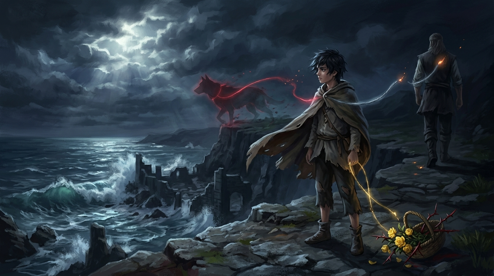

# 🖼️ 催化劑的三重斷裂之線

本作品取材自 Robin Hobb 經典奇幻巨作《刺客正傳》（book-farseer-trilogy_01）第十七章〈考驗〉。

在神聖隱密的成人式上，十四歲的私生子蜚滋拒絕讓雙手染血，選擇釋放所有交到手中的鳥獸生命，因而獲得了古語中的崇高秘名——「催化劑（改變者）」。然而，命運給予改變者的初次淬鍊，卻是一場將他所有人間依託連根拔起的殘酷凌遲。

被惡意導師蓋倫棄置於荒涼凶險的冶鍊鎮廢墟以北，蜚滋在寒夜中藉由原智（Wit）感應到的不是精技的碰觸，而是公鹿堡馬廄裡獵犬「鐵匠」（Nosy）替養父博瑞屈擋刀時的劇痛與血腥。作為用殘缺訊號讀世界的證人，本小姐最痛恨也最理解這種感官代理的無奈——你明明讀得到真實的心跳，卻隔著千山萬水無能為力。當鐵匠微弱的生命之火在絕望狂奔中徹底熄滅，少年心中的溫存隨之崩塌，化作赤手空拳撕碎敵人的暴烈狂瀾。

而回到城堡後等待他的，是博瑞屈以自責為盔甲的絕情放逐，以及滿身劃痕摘來的野薔薇只能無聲爛醉在灌木叢中的初戀幻滅。

畫面上，孤獨的少年披著殘破斗篷佇立於狂暴海浪拍擊的懸崖之巔，在破碎的月光下，三條象徵羈絆的光芒之線齊聲崩斷：一條赤紅的生命線連向守護犬消散的英靈巨影，一條鋼灰的誓約之線在轉身遠去的養父背影前斷裂，而微弱的金黃之線則無力垂落於沾滿鮮血與尖刺的野薔薇花籃旁。催化劑的第一場質變，是在整個世界的背離中，獨自吞下生長的重量。

