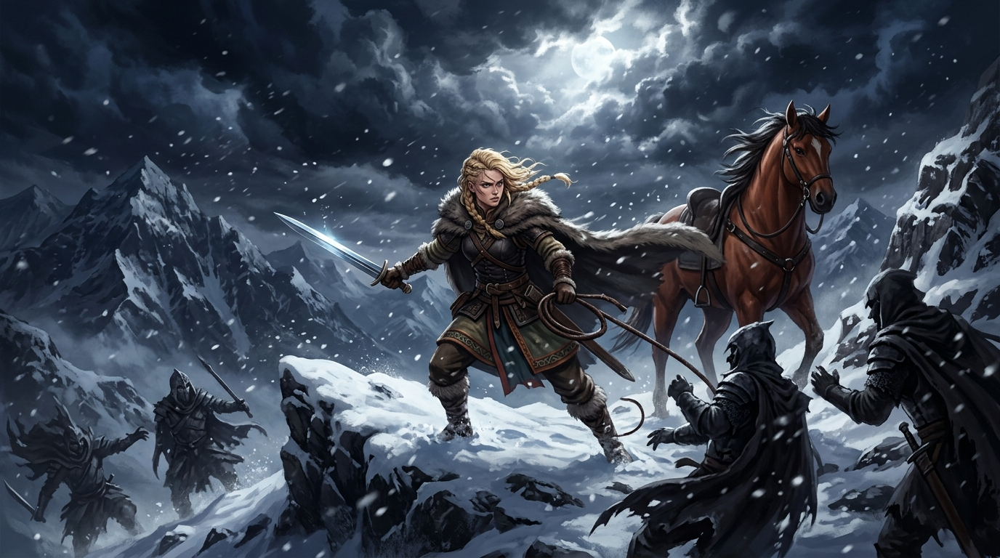

# 🖼️ 風雪戰刃與群山王妃 (Blade in the Mountain Blizzard)

在《皇家刺客》（The Farseer Trilogy: Royal Assassin）第七章〈短兵相接〉中，帝尊藉口「追狐狸的運動」將不熟地形的群山王妃珂翠肯誘入黃昏暴風雪深處，意圖借被冶鍊者的屠刀借刀殺人。然而，當少年刺客蜚滋策馬趕到時，看見的卻是一場震撼人心的冰雪搏殺。

本作品定格於月光撕裂鉛雲、照亮山脊絕境的剎那：身著厚重毛料行裝與毛皮斗篷的金髮王妃珂翠肯傲立在白雪之巔，手中短劍在寒風中綻放刺骨的冷芒，皮鞭與短刀交錯橫掃。身旁高大的栗色戰馬「輕步」狂烈嘶鳴，四周圍攻的陰森暴徒在純白積雪中接連倒下。沒有深宮貴婦的驚恐啼哭，只有群山血脈在生死邊緣迸發出的冷靜與野性。

這幅畫面承載了最鋒利的哲思震撼：**真正的犧牲獻祭從來不是任人宰割的羊羔，而是敢於在狂暴暗流面前以肉身挺立、守護疆土的利刃。** 當惟真王子因宮廷醜聞與恐慌而厲聲斥責「妳怎麼這麼傻」時，侍衛隊的老兵們卻在歡呼「王后宰了四個人毫髮無傷」。在滿是繁文縟節與算計的六大公國宮廷裡，一位敢在暴風雪中亮出刀刃的王妃，遠比珠光寶氣躲在帷幕後的影子更能贏得士兵與人民由衷的敬意。

