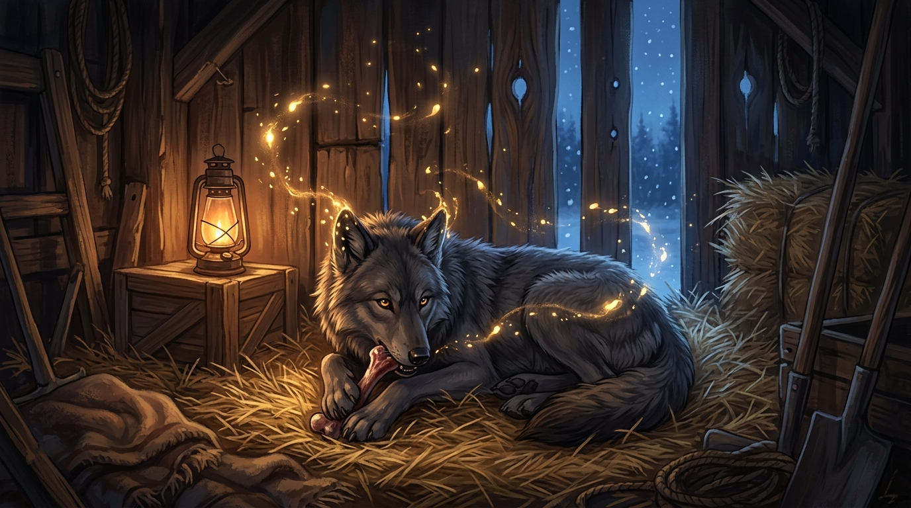

# 🖼️ 靈魂雙向的狼群呼吸 (Two-Way Breath of the Pack)

在《皇家刺客》（The Farseer Trilogy: Royal Assassin）第七章〈短兵相接〉開篇，蜚滋來到城堡後方的小木屋餵食被秘密收留的幼狼夜眼（Nighteyes）。少年試圖在心靈深處築起自欺欺人的壁壘，以人類的文明傲慢宣稱「我餵你、我教你打獵，等時機到了就把你留在遠方」。然而，年幼的黑灰野狼卻用最澄澈的原思，反手敲碎了這堵虛妄的高牆。

本作品描繪了木屋草堆深處靜謐而神聖的心靈共契：窗外漫天飛雪，暖黃的油燈光暈勾勒出幼狼濃密的毛髮與鋒利的爪牙；夜眼伏臥在柔軟的麥稈上嚼著骨頭，那雙燦金若琥珀的狼眸毫無畏縮地凝視著對面的人類。金色如微粒星塵的原思光芒在一人一狼的心靈空隙中盤旋交融——那不是法術的束縛，而是荒原深處古老群體意志的無聲流淌。

夜眼在章節中那一聲嘲笑，是直擊靈魂的通信契約箴言：*「我難道只能在你沒呼吸時才能呼吸嗎？你的心靈、我的心靈，都是同個狼群的心靈。如果你不想聽見我，就別聽呀！」*
**牽絆從來不是一個可以由單方任意開關的閥門；連線一旦建立，呼吸就是彼此共鳴的。** 蜚滋想單方面掐斷感應，本質上只是害怕深陷牽絆所要付出的脆弱代價。但在孤絕與殘缺的世界裡，承認連線的雙向性並主動在心中築起真確的屏障，才是一個人在風雪中保護自己與至親同伴的真正成熟。

