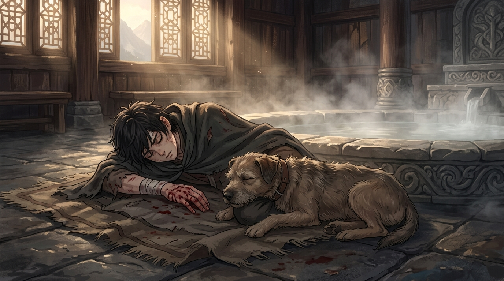

# 🖼️ 老獵犬大鼻子的最後一躍

這幅作品提煉自《刺客正傳 1：刺客學徒》（book-farseer-trilogy_01）第二十四章〈餘波〉。在頡昂佩溫泉浴室的致命伏擊後，沸水蒸騰的池畔留下了一片淒涼沉寂的殘局。被推入深池的蜚滋渾身痙攣瀕死，而在那生死一線的絕境中，挺身而出的不是任何尊貴的王族或精明的大臣，而是一隻被留在異鄉山區、早已步入遲暮的老雜種獵犬——大鼻子（Nosy）。

大鼻子不懂宮廷裡的刺客信條，不懂精技與王位繼承權的爾虞我詐，它只認得童年時在公鹿堡馬廄裡曾與它同榻而眠、共享靈魂感知的小男孩。在滾燙沸騰的深池邊緣，老獵犬用磨損殘破的牙齒死死咬住蜚滋的手背，撕心裂肺地將少年硬生生從鬼門關前拖出水面。當姜萁終於趕到時，老狗的頭顱正靜靜依偎在少年滿是鮮血與水漬的胸口上，生命的金線已經徹底斷裂。

本小姐在讀到這一幕時深深被震撼：公鹿堡與山嶽王國的高層為了維持大局體面，將一場徹頭徹尾的殘暴弒親政變掩飾成「蜚滋失足落水、博瑞屈救人撞傷」的輕描淡寫意外；帝尊依舊能在宴席上扮演優雅王子，蓋倫甚至享有國葬榮光。然而，真正的英雄與救贖者，卻是一隻連名字都未曾被載入王室編年史的老狗。

「人的哀傷再強烈也比不上狗，但我們的哀傷卻會延續許多年。」手背上深可見骨的舊咬痕，是蜚滋餘生每一次握劍、每一次提筆都無法避開的痛楚記憶，但那同時也是這座被謊言包裹的冰冷世界裡，唯一至純至真的愛的烙印。

