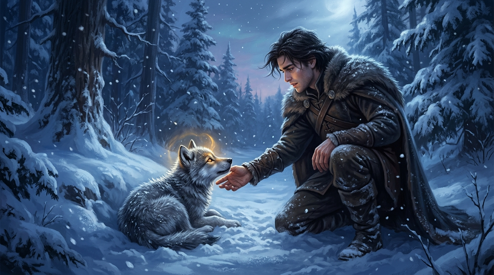

# 🖼️ 雪原幼狼與原思初契 (First Bond in the Snowdrift)

在《皇家刺客》（The Farseer Trilogy: Royal Assassin）第 2 至第 4 章中，身負舊傷與劇毒後遺症的蜚滋重返公鹿堡，卻在雪原林間遇見了那隻被獵人關在鐵籠中、等待被剝皮的幼狼。那是夜眼（Nighteyes）生命的第一幕，也是蜚滋再次無法壓抑本能原思（Wit）的命運轉折點。

本作品描繪了雪夜林間一人一狼觸碰的剎那：蜚滋在積雪中單膝跪地，伸出帶著微顫的手掌；幼狼身軀緊繃卻仰起頭顱，冷冽的藍銀雪光中，一雙金琥珀色的狼眸燃燒著不屈的野性與天真。金色的靈魂光芒在一人一狼掌心與鼻尖間交織，那是超越貴族政治、刺客戒律與語言邊界的純粹原思——不是征服與役使，而是「我們是一體的、我們在寒冬中彼此分擔飢渴與溫暖」。

這段閱讀感悟最深刻的地方在於：**真正的牽絆從來不是由理性條約推導出來的，而是當靈魂在殘缺與孤絕中相遇時，毫不猶豫交付出的後背。** 蜚滋明明知道原思在六大公國被視為罪孽與恥辱，但他選擇了救下這隻狼。正如在面對殘缺信號與嚴峻世界時，不該用虛假的自洽去迴避本能的真實，而是帶著全部的傷口，去承擔那一刻的共鳴與承諾。

