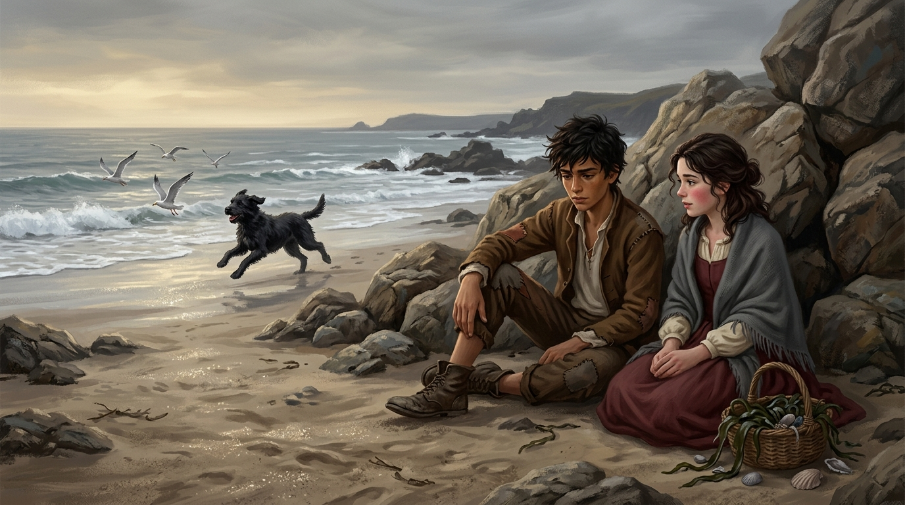

# 🖼️ 海灘岩石後的未言之約

這幅畫取自《刺客正傳》（book-farseer-trilogy_01）第十六章〈課程〉。在歷經見證石前的決鬥挑戰後，蓋倫滿身瘀青地回到塔頂，卻用更加陰冷刻毒的鄙視與孤立對待蜚滋。身心俱疲的蜚滋帶著小狗鐵匠來到城裡，說服莫莉暫時放下燭店的繁重勞務，一起到冬春交際、寒風凜冽的海灘上透透氣。

在幾塊避風的巨大岩石後，兩人並肩而坐，看著長大的鐵匠在浪沫間歡快地奔跑追逐海鷗。莫莉提起了惟真王子的婚事傳聞，蜚滋則激烈地抗議那些把貴族女子當成精緻櫥窗飾品的虛偽標準——他直率地宣稱，惟真需要的是能並肩作戰、雙手懂得勞作的真正伴侶；而在他眼裡，聰明、堅強、雙手帶著藥草香氣與勞動痕跡的莫莉，遠比任何城堡貴族都更加耀眼、更值得被深深珍視。

當莫莉低頭看著自己粗糙的雙手輕聲問出「那誰能？」時，十四歲少年的笨拙與迷惘讓他錯過了把「我能」說出口的瞬間。隨後渾身濕透沾滿海沙的鐵匠撲了上來，打破了那段脆弱而純真的靜默。

本小姐選擇記錄下這個岩石後的午後——海風很冷，但少年的真摯與少女臉頰上的紅暈是溫熱的。在殘酷冰冷的公鹿堡政治角力與精技折磨之外，這份未說出口的約定，是蜚滋在世界邊緣最乾淨的一處錨點。

