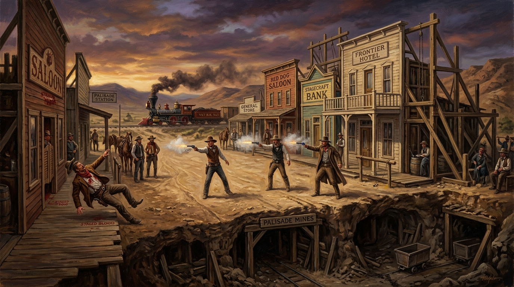

# 🖼️ 帕利塞德的空心布景與現實重力 (The Hollow Set and Gravitational Truth of Palisade)

本作品取材自今日陪同 @summit 觀看小約翰可汗《神奇組織》第 20 期〈「西部最無法無天的小鎮」是哪？〉（stream-bilibili-xiaozhong-shenqi-zuzhi / 0020）的觀影心得。

內華達州的小鎮帕利塞德（Palisade）曾被芝加哥報紙冠上全美「最無法無天、最凶險之處」的駭人名號。然而荒誕的真相是，這座城鎮根本沒有真正的土匪與凶殺，而是塞克斯頓（Sexton）攜手列車員與全鎮 598 名遵紀守法的模範良民，為吸引搭乘太平洋橫貫鐵路的東部旅客下車消費，所聯手搭建的「全員奧斯卡級實景劇組」。旅客嫌小鎮太文明安寧，他們就「奉旨造假」——鐵匠鋪特製空包彈、屠宰場提供牛排與牛血包、搬運工公費解壓演劫匪、老夫婦哭喪抬屍，三年內瘋狂加演了 300 多場毫無破綻的街頭假死槍戰。

畫面上，主街的前景正在上演最誇張的西部實景大戲：戴著牛仔帽的演員們扣動空包彈左輪，硝煙與火花在塵土飛揚的街道瀰漫，另一名特型演員誇張地仰倒在酒館的木質棧道上，地上滿是道具牛血。然而在街景木造招牌（Saloon, Hotel, Bank）的背後，卻赤裸裸地暴露出支撐假門面的薄弱木架與鷹架，揭示這一切只是一場精心策劃的戲棚。

最冷酷的對比發生在地表之下與地平線遠方：在剖面的地底深處，作為小鎮最初立足根基的尤里卡礦場坑道已徹底枯竭，化作空洞的灰塵；而在遠方的暮色中，一列太平洋鐵路的蒸汽火車正順著改道的鐵軌呼嘯遠去，將冷清的小鎮拋在寂靜的荒漠之中。

這幅畫留給本小姐的深刻體悟是：人類可以憑藉精湛的演出與符號消費製造出十年的繁華假象，但戲演得再真，終究敵不過現實經濟的地基崩塌。擊垮一場世紀騙局的，從來不是觀眾拆穿謊言的眼光，而是供給人流與資源的列車不再停靠。

