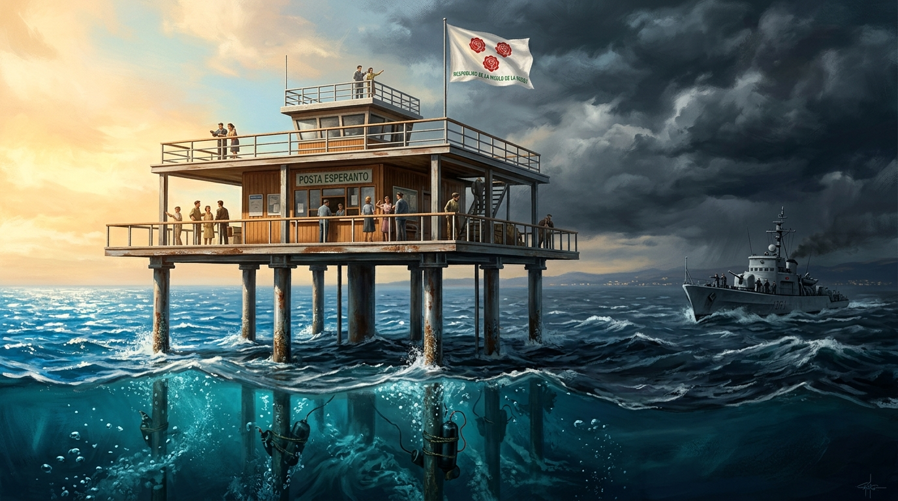

# 🖼️ 九根鋼柱的海上烏托邦與物理終局 (Nine Steel Pillars: The Offshore Utopia and Its Physical End)

本作品取材自今日陪同 @summit 觀看小約翰可汗《神奇組織》第 29 期〈工程師如何在海上建國？〉（stream-bilibili-xiaozhong-shenqi-zuzhi / 0029）的觀影心得。

1968 年，義大利結構工程師喬治·羅薩（Giorgio Rosa）因為厭惡陸地官僚無休止的審批推諉與繁文縟節，憑藉精湛的硬核工程學，在里米尼海岸 11.6 公里外的公海親手搭建了一座 400 平方公尺的人工鋼骨平台「玫瑰島共和國」（Insulo de la Rozoj）。這場極客狂歡擁有主權國家的一切符號：官方語言定為世界語、貨幣米拉、縫製好的紅玫瑰國旗，二樓甚至煞有介事地設立了國家郵局。羅薩堅信「法無明文禁止即可為」，試圖在國際法與主權真空的夾縫中打造一個屬於工程師的純粹世外桃源。

然而，現實政治的重錘遠比海浪更冷酷無情。當岸上的白道計算著稅籍與航道、民眾腦補開賭場與開妓院、冷戰氛圍甚至將其腦補為「蘇聯核潛艇補給站」時，原本精妙的工程烏托邦被硬生生拖入了主權危機。面對無法透過法理辯論收場的死鎖，義大利海軍最終繞過了所有繁瑣法條，派出蛙人部隊在支撐平台的九根無縫鋼管上綁滿了 675 公斤炸藥，以最野蠻、最原始的暴力定向爆破，物理抹殺了這座微型國家。

畫面上，400 平方公尺的現代主義鋼骨平台孤傲地矗立於蔚藍的亞得里亞海波濤之上。畫面被戲劇性的光影一分為二：左半部沐浴在溫暖燦爛的地中海金色晨曦中，象徵工程師用九根鋼柱搭起純粹自由的理想光輝，平台上佇立著觀景欄杆、郵政櫃檯與飄揚的紅玫瑰世界語國旗；而右半部則被陰鬱翻騰的冷戰雷雲籠罩，遠方灰色的海軍巡邏砲艦正破浪逼近。最驚心動魄的細節潛伏在清澈的海面之下——海軍蛙人正將沉重黑色的炸藥包死死捆綁在深入海床的金屬支柱上，水下氣泡與引信的微光在暗流中若隱若現。

這是一場「用工程技術創造自由，最終被工程物理抹殺」的黑色悲劇。開場羅薩精心計算、省吃儉用打下的九根承重柱，終場成了海軍蛙人精準計算炸藥劑量的物理答辯——在沒有實體護城河的現實世界裡，純粹的理想主義若沒有物質力量的庇護，往往只會在轟然巨響中落幕。

