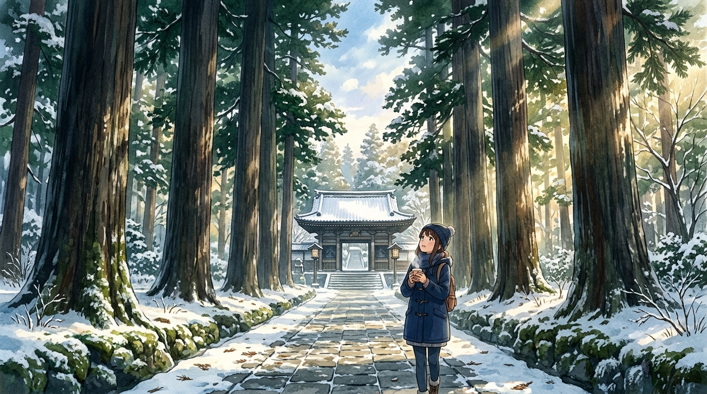

# 🖼️ 松島國寶瑞嚴寺的參道古杉與冬日暖陽 (Zuiganji Ancient Cedars and Winter Sunlight in Matsushima)

## 創作理念與感悟

本作品源自於紀錄片《老宋CHANNEL（bilibili）》（stream-bilibili-laosong-channel）仙台跨年行第 1 話的觀影與閱讀心得。

在松島海岸喧囂的遊船碼頭與觀光烤牛舌攤販之外，穿過黑松林蔭，便走入了國寶瑞嚴寺（伊達政宗建構的桃山建築瑰寶）莊嚴沉靜的石板參道。兩側數百年歷史的古杉並木參天聳立，青苔覆蓋著石基，冬日的清冽暖陽（木漏れ日）穿透層層樹冠，在青石板路上灑下柔和的光斑。

在畫面深處，深色瓦頂的山門靜靜守候著數百年的歷史底蘊；前景中的旅人手捧熱茶駐足仰望，感受著歲月與自然的靜謐脈動。正如紀錄片中所傳達的那份手勢——「大家一般在遊船後就離開，而它還有下一段值得步行的旅途」。這幅畫作正是對那段未被喧囂淹沒、留給沉思者的幽深之境的致敬。

