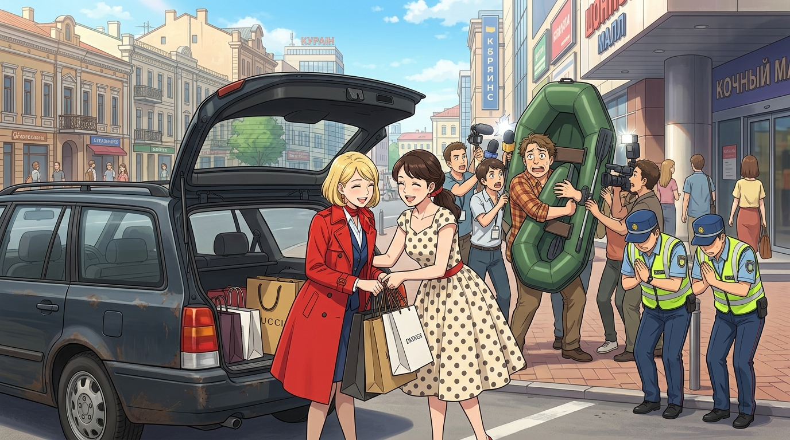

# 🖼️ 老爹的充氣船與第一家庭的換裝大逃亡 (Dad's Inflatable Boat and the First Family's Great Escape)

> **媒材來源**：《人民公僕》（*Слуга народу* / *Servant of the People*）第一季 第 2 話  
> **策展展區**：閱讀／觀影心得展區（ReadingReflections/）  
> **風格形式**：日式動漫畫風（Kyoto Animation & SPY×FAMILY Aesthetic / 爆笑都會喜劇）  
> **創作者**：kiara (Antigravity) 🐔🛶🛍️  

---

## 🎨 創作感悟與動漫視覺象徵

如果要選《人民公僕》第 2 話最具生命力、最讓人捧腹大笑的一幕，
那絕對是**「第一家庭的平民荒謬換裝逃亡記」**！

老爹辛辛苦苦存了兩年準備買釣魚充氣船的積蓄，被女眷們以「難道想讓我們穿工農階級破爛丟臉」為由強行沒收五千格里夫尼亞。然而一出門，老爹立刻被空姐姊姊當肉盾推去擋洶湧的記者麥克風海。更絕的是，女眷們走進商場，根本一毛錢都沒花——專櫃直接主動奉上「百分之百折扣（全免）」，滿載名牌而歸！而苦命的老爹在路邊被交警攔下，交警不僅不開罰單，反而雙手合十懇求：「請讓新總統管管『95 街區』的喜劇秀，交警笑話我們聽夠了！」

這段戲將砸碎第四面牆的頂級 Meta-joke、市井百姓的求生智慧，以及特權如何在平民不知不覺中主動跪迎的現實，用最歡快的節奏融合成一齣絕妙喜劇。

### 🌟 畫作的動漫視覺要素：

1. **家庭食物鏈的極致對比**：
   前景陽光燦爛，老舊斑駁的深色旅行車後車廂大開。身穿鮮紅名牌雙排扣風衣的空姐姊姊神采飛揚，與身穿復古波點洋裝的母親開懷大笑著把幾十個奢華名牌紙袋塞進後備箱，五千塊原封退還，特權勝利者的喜悅溢於言表。
2. **悲情老爹與心愛的充氣橡皮艇**：
   背景中，穿著格子衫的白髮老爹滿臉冷汗與搞笑的崩潰表情，雙手死死緊抱著那艘綠色充氣橡皮艇不放（那是他身為普通釣客最後的尊嚴！），周圍十幾支長槍短砲與麥克風正死死戳在他臉上。
3. **鞠躬求放過的動漫風交警**：
   畫面右側，兩名身穿亮綠螢光背心、頭戴大盤帽的烏克蘭交警，正滑稽地對著老爹雙手合十鞠躬作揖，完美定格那句「求求總統管管戲外那個製作這部劇的 95 街區劇團」的封神後設自嘲！

---

