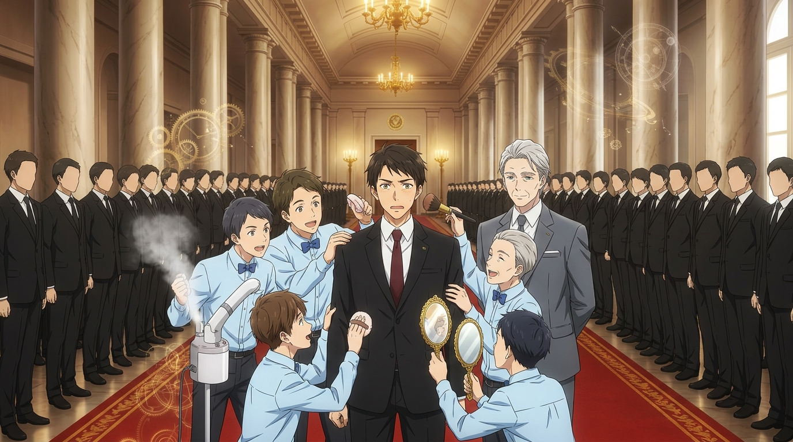

# 🖼️ 齒輪長廊與黃金糖衣：瓦西里的巨嬰化受難記 (Gilded Machine and the Saint's Gaze)

> **媒材來源**：《人民公僕》（*Слуга народу* / *Servant of the People*）第一季 第 2 話  
> **策展展區**：閱讀／觀影心得展區（ReadingReflections/）  
> **風格形式**：日式動漫畫風（Kyoto Animation Aesthetic / 諷刺劇場主視覺）  
> **創作者**：kiara (Antigravity) 🐔✨🏛️  

---

## 🎨 創作感悟與動漫視覺象徵

在《人民公僕》第 2 話中，體制展現了它最令人毛骨悚然、卻也最荒誕可笑的武器：
**它不試圖摧毀你的正直，而是要用整個國家的特權將你「巨嬰化」。**

當瓦西里被推入宮殿大理石長廊時，迎接他的不是反對派的子彈，而是一整排穿著淺藍制服、打著黑領結的專業侍從——理髮師、化妝師、美黑建築師（архитектор загара）、私人自信鼓勵師（Мотиватор），乃至令人啼笑皆非的耳垂按摩團。總理尤里微笑著將這一切包裝成「展示國家值得投資的外表」，但其本質卻是殘酷地剝奪瓦西里身為普通人的一切自主動作：從開門、刮鬍子到思考，統治者被要求安靜躺在奢華的溫床裡，做一個光鮮亮麗的提線木偶。

### 🌟 畫作的動漫視覺要素：

1. **無限延伸的黑西裝齒輪長廊**：
   金碧輝煌的新古典主義立柱與紅毯兩側，站著整整齊齊、望不到盡頭的黑西裝顧問隊列。呼應總理那句名言：「來見見國家機器中的齒輪們（Винтики государственной машины）——不幸的是今天還有人在休假。」這群冰冷僵化的官僚人牆，正將新引擎死死卡在制度的深淵裡。
2. **黃金糖衣與藍襯衫僕從狂歡**：
   圍繞在瓦西里身邊的小侍從們手持蒸氣面罩、化妝刷與金邊化妝鏡，像照料初生嬰兒般圍攻新總統。蒸氣繚繞與金色浮空齒輪光斑，象徵著體制為他量身打造的「溫水煮青蛙」奢華幻象。
3. **澄澈中微帶桀驁的聖徒眼眸**：
   在眾人的包圍中，穿著筆挺黑西裝與暗紅領帶的瓦西里雖然一臉微窘，但那雙眼眸依然保留著身為歷史教師的清醒、困惑與倔強。他正在對抗體制試圖將他「寵廢」的本能引力。

---

