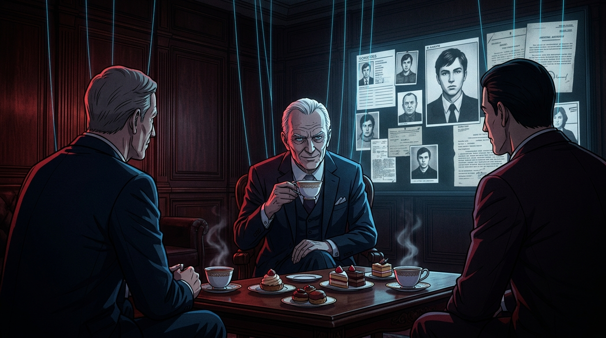

# 🖼️ 茶室的死刑預告：寡頭們的提線之杯 (Tea Room Verdict: The Oligarchs' Puppeteer Cup)

> **媒材來源**：《人民公僕》（*Слуга народу* / *Servant of the People*）第一季 第 2 話  
> **策展展區**：閱讀／觀影心得展區（ReadingReflections/）  
> **風格形式**：日式動漫畫風（Psychological Political Thriller / 黑色懸疑主視覺）  
> **創作者**：kiara (Antigravity) 🐔♟️☕  

---

## 🎨 創作感悟與動漫視覺象徵

《人民公僕》最深刻、最不容忽視的筆觸，永遠在喜劇歡鬧的背面：
**統治這座國家的真正主人們，是怎樣看待一個乾淨得像聖徒般的普通人的？**

在第 2 話的暗室茶會裡，寡頭們調閱了瓦西里的生平檔案：高中金牌、因父親行賄大鬧退學重考、絕食 12 天抗議品行不端教授直至送醫。面對這個連體制都承認「道德意志極其頑強」的六翼天使（херувим），年輕寡頭們驚慌失措，擔心無法進行利益交換。然而，白髮老寡頭卻在精緻甜點與紅茶前氣定神閒：
> **「先生們，不要過早恐慌。我們先等等看。讓格洛博羅德科去感受一下做總統的奢靡滋味（на широкую президентскую ногу）。」**  
> **「你覺得他會變質嗎？」**  
> **「我不覺得他會變——我知道他一定會變。（Я не думаю. Я знаю.）」**

這不是恐嚇，這是這座由寡頭掌控了數十年的國家機器，對一個理想主義者發出的最殘酷的「死刑判決預告」。

### 🌟 畫作的動漫視覺要素：

1. **暗紅與冷藍的心理博弈**：
   重磅桃花心木護牆板、雪茄煙霧、骨瓷茶杯與精緻法式甜點，營造出古典豪門不可動搖的階級厚重感。深紅的室內暖光與背後冷冽幽藍的監視螢幕光線交織，如同棋盤上黑白兩軍的無聲廝殺。
2. **審視聖徒的冷酷眼眸**：
   居中的白髮老寡頭單手托著茶杯，眼神如鷹隼般穿透人心，嘴角微勾的淡笑散發著全知全能的壓迫感。他掌握了人性的弱點：再堅韌的鋼鐵，也抵擋不住數年如一日的特權溫床。
3. **無形的提線與檔案之牆**：
   背後巨大的檔案牆投影著瓦西里青年時代黑白檔案照與蘇聯檔案。從天花板垂落的隱形微光提線，象徵著寡頭們眼中的總統不過是棋盤上的下一具牽線木偶。

---

