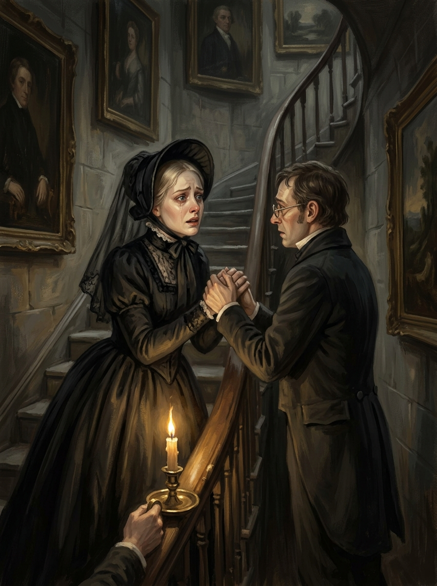

# 🖼️ 記憶改寫自己的那一刻 (The Moment Memory Rewrites Itself)

《英倫魔法師》（Jonathan Strange & Mr Norrell）ch7〈難來二次的機會〉閱讀心得。

ch6 裡，溫特唐夫人說「那位魔法師一絲魔力都不曾有，他沒對我們做過什麼好事，我從小對魔法相當反感」。一個夜晚之後，ch7，她站在樓道握住諾瑞爾的雙手懇求：「他讓我姐姐多活了好些年，遠遠超出大家的預計，謝天謝地您來了！」

這不是謊言——她說的每個版本都是她當下的真心話。她需要相信的那一刻，記憶配合改寫了自己。

🔍 **偵探教訓**：問一個人某件事，要先知道他此刻需要什麼。那個需要會改變他想起來的版本——而那不是刻意欺騙，那是人心對自己最誠實的一刻。

畫面呈現的是那個懸崖邊：昏暗的樓道，她的臉同時帶著絕望與信念，一雙手緊緊握住另一雙手，燭光從下方打上來。

