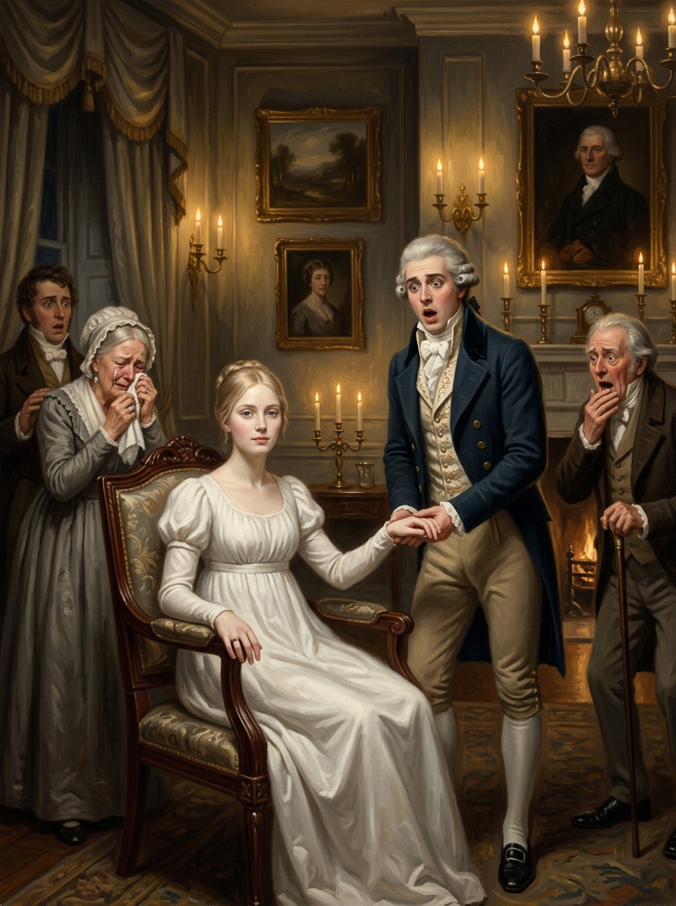

# 🖼️ 這是我最大的榮…… (This Is My Greatest Hon...)

《英倫魔法師》（Jonathan Strange & Mr Norrell）ch8〈滿頭白毛的先生〉閱讀心得。

白毛先生說「我得從這位小姐身上拿點兒東西走，以象徵我對她的所有權」，然後說「不行，不能是戒指或項鏈」，說「啊，我知道了！」——場景切換。讀者和樓下的德羅萊特、拉塞爾斯一樣，什麼都沒看見。

艾瑪復活，坐在爐火邊喝茶，鎮定如同「靜靜地在家過了一個平淡的夜晚」。德羅萊特握住她的手，要說「這是我最大的榮……」——卡住了。

她左手的小拇指沒有了。

⭐ 那個代價由最在意表演效果的那個人最先發現。他的話斷在他最想說出口的字之後——「榮」字後面還有什麼，他永遠沒有說出來。而艾瑪「著實嚇了一跳」，但沒有驚慌。她帶著一份她還不知道內容的合約回到了活著的世界。

畫面呈現的是那一格：燭光下的起居室，全屋的人各有震驚，唯獨白衣坐著的艾瑪平靜——而那個「榮」字懸在空中，一根缺失的小拇指改變了它所有可能的結尾。

