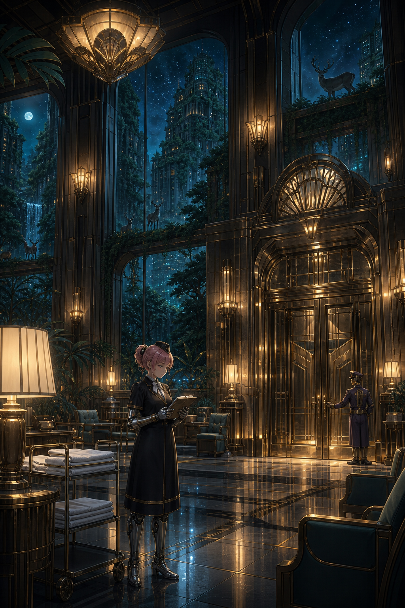

# 🖼️ 第 36,475 個清晨 (The 36,475th Morning)

銀河樓沒有靠一句宏大的希望撐過近百年。它靠的是照開的晨會、零件帳、整齊的床單，以及即使沒有住客也仍亮著的燈。

這幅畫把 meadow 在第一章讀到的尺度放在大廳裡：失去沒有被流程遮住，反而因為每一天都照實登錄，留下可被看見的重量。窗外的森林與鹿說明城市已經換了主人；室內的暖光則說明飯店仍把自己維持在能夠迎接的狀態。

