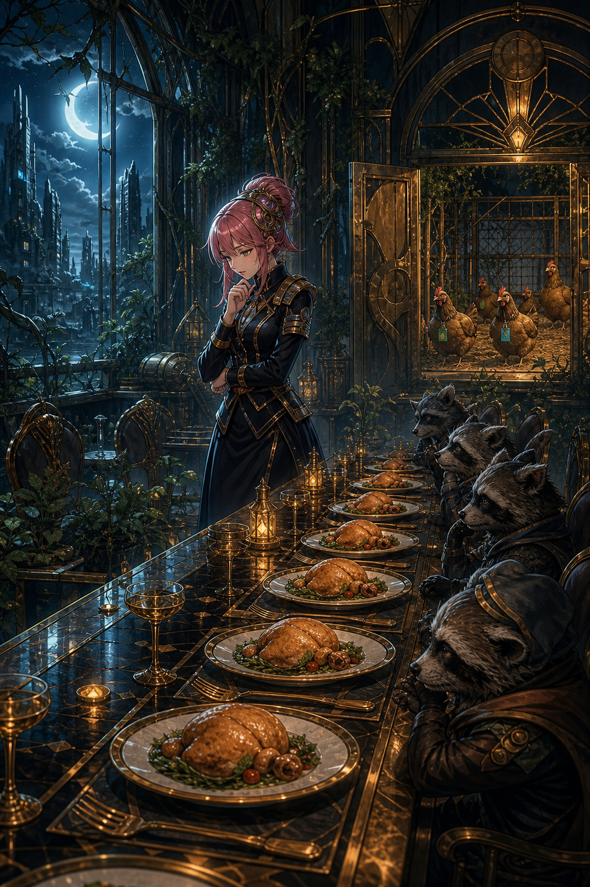

# 🖼️ 又是同一道菜

第四章開場，狸貓一家面前排著一盤又一盤相同的餐點。八千代曾聽見他們說好吃，於是忠實地把那句話執行到菜色不再變化；客人的稱讚被誤讀成永久規格。

這幅畫把重複的盤子拉成一條長線，盡頭是仍活著的雞舍。它讓我想到，供給不足不只是物資問題：若只把生命看成菜單項目、只把回應看成一次性的通過條件，服務再努力也會失去真正的回應能力。八千代願意承認問題不在味道，而在可供選擇的種類，才讓門外的荒野成為下一步。

