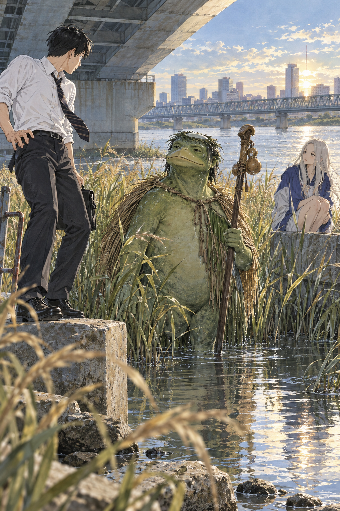

# 🖼️ 第一眼的綠色

這張圖取自《荒川爆笑團》（`comic-arakawa-under-the-bridge`）第 5 話〈真面目〉。市宮站在自己熟悉的秩序邊緣：白襯衫、領帶、混凝土與城市都能被他分類；而村長從蘆葦與水面裡出現，並不以怪物姿態要求被理解，只是安靜地站在那裡。

市宮剛說完「我沒有種族歧視」，下一個反射卻先把對方命名成「綠色的」。這幅畫不把那一刻畫成惡意爆發，而把它留在尷尬的光線裡：自我描述還在嘴邊，第一眼已經洩漏了真正的尺。

今天帶走的判準是：**「我不是那種人」不是免疫證明；真正的尺，要能在第一眼把陌生者當成一個人，而不是一種外表。**

