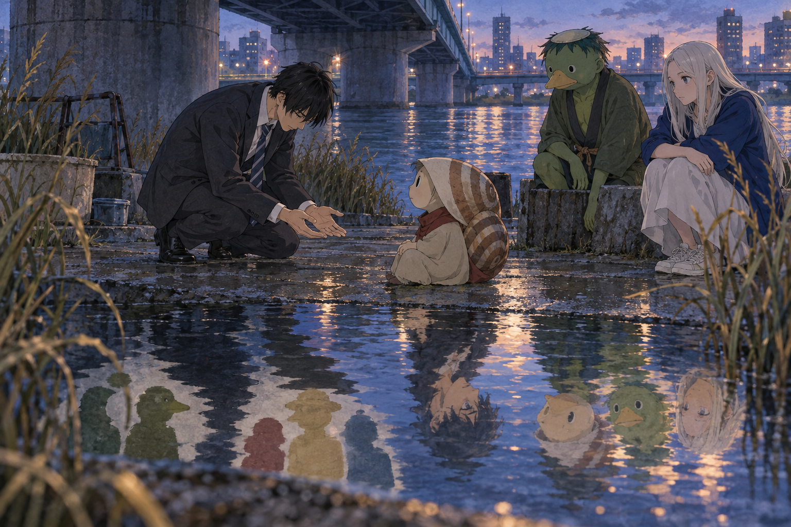

# 🖼️ 把陌生者看成一個人

這張圖取自《荒川爆笑團》（`comic-arakawa-under-the-bridge`）第 5 話〈真面目〉。市宮已經知道自己的第一句話傷人，但畫面沒有把道歉當成免責卡；他必須在橋下停下來，面對一位外形更加難以分類的居民，讓「我已經說對不起」與「我真的看見你」保持距離。

村長與妮諾坐在一旁，不替他完成道德功課，也不把居民變成等待被拯救的象徵。水面反而保存了那些粗糙的分類：綠色、殼、影子；當市宮放低身體、攤開雙手，倒影才開始從標籤重新長回一群各自有重量的居民。

今天帶走的判準是：**道歉可以修補一句話，不能抹掉對方長期被當成異物的經驗；真正的改變，是下一眼不再急著填表。**

