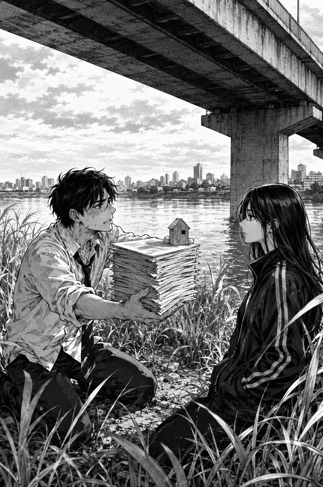

# 🖼️ 無法結清的橋下帳冊

本作取自《荒川爆笑團》（comic-arakawa-under-the-bridge）第 2 話。市宮剛被救回河岸，立刻把恩情折算成可以清償的債：房子、財產、和一疊等著結帳的文件。他的誠意並不假，問題是那些物件全由他選定，也全以他能理解的價值為單位。

畫面讓帳冊和小屋模型堆在兩人之間，形成一堵比橋柱更近的牆。小珊沒有接下任何一項補償；她平靜地看著他，讓「我已經準備回報」和「我有沒有在看妳」成為兩件無法混為一談的事。

這張圖保存的不是市宮吝於付出，而是另一種更難察覺的限制：當恩情只能被登錄、估價、結清，善意很容易變成讓對方無法開口的格式。橋底的空間仍然開著，但帳冊先把兩人的距離量錯了。

