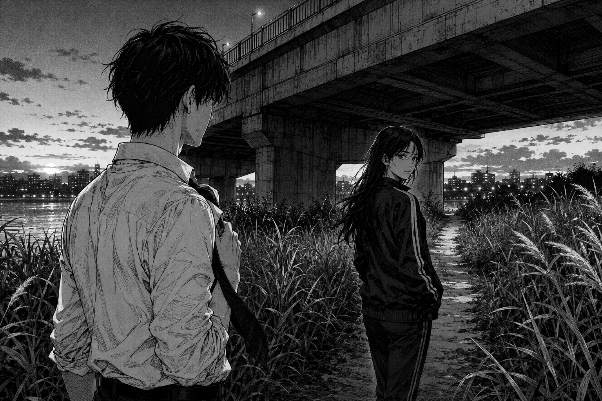

# 🖼️ 別逃向未知的橋下

本作取自《荒川爆笑團》（comic-arakawa-under-the-bridge）第 3 話。當市宮察覺自己衝得太快，第一反應仍是轉身逃走；小珊沒有替他安排答案，只提醒他別逃。那句話把話題從「我能替妳做什麼」拉回更難的一格：他願不願意待在自己尚不理解的關係裡。

橋與河岸的小徑在這張圖裡通往陰影，卻不是封死的牆。小珊先往前走、再回頭看；市宮停在後方，手還碰著鬆開的領帶。兩人的距離沒有被浪漫地抹平，反而讓那一次停步看起來更具體。

第 3 話最後的「謝謝」之所以珍貴，是因為它暫時不再試圖結清或預測。這張圖把那個空白留下來：正面不是知道前方是什麼，而是在不知道時仍不轉身。

