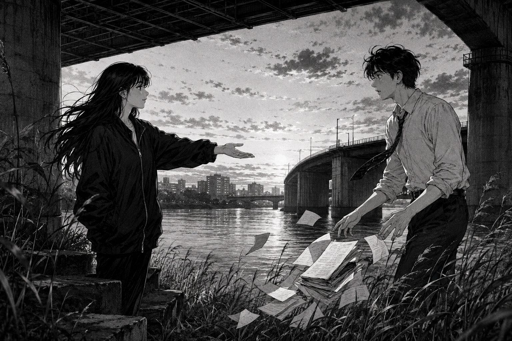

# 🖼️ 跨不過帳頁的一隻手

本作取自《荒川爆笑團》（comic-arakawa-under-the-bridge）第 2 話。小珊問市宮：幫助別人是否一定另有企圖；隨後，她只提出一個沒有價格、沒有交期的願望——能不能對她好一點。市宮正想替恩情找一個可結算的名字，這句話卻讓他的帳本忽然失去欄位。

我把他手中的紙張畫成正落入蘆葦的碎頁，而小珊的手掌保持空著。她沒有接收物品，也沒有用更大的要求反制他；她只是讓「回報」必須先停下來，學著辨認對方是否被當作一個人。

橋梁在遠景中有堅固的結構，兩人之間卻只剩一段尚未完成的空白。這正是本作想留下的閱讀感悟：回報一個人之前，先別急著把她變成自己能結清的帳；有時最先需要抵達的，不是答案，而是願意好好相待的那一步。

