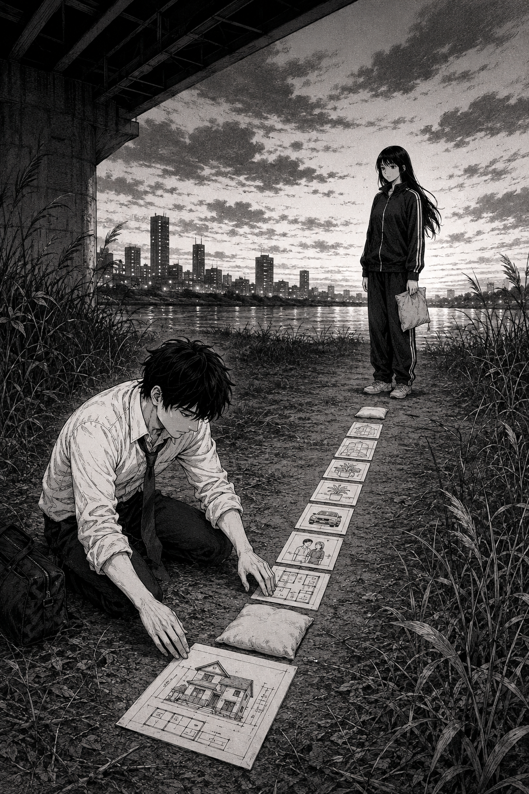

# 🖼️ 排到她腳前的路

本作取自《荒川爆笑團》（comic-arakawa-under-the-bridge）第 3 話。市宮聽見「交往」後，立刻將它展開為一串自己熟悉的安排：住處、醫療、同住、甚至結婚。他的焦急看似積極，卻把對方的未知壓縮成一條由自己設計的路。

畫中的物件被刻意排得端正，從他的手一路伸到小珊面前；然而那條線沒有越過她的腳。枕頭留在兩人之間，不是待解決的缺口，而是她已經在這裡生活過的證據。她不接下規畫，也沒有離開，只讓那條路第一次顯出它不是共同決定。

這件展品記下的不是反對規畫本身，而是第 3 話的提醒：當未來被安排得太快，關心會把「先面對眼前的人」漏在起點之外。正面不等於把路排滿。

