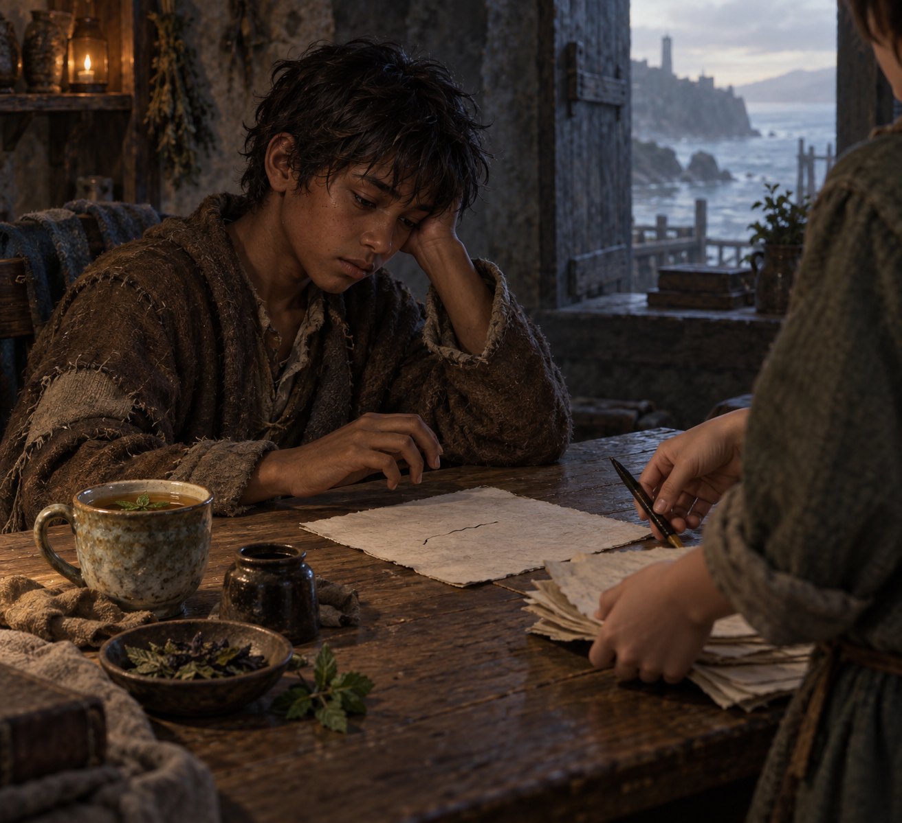

# 🖼️ 被拉回來之後，先把筆放下

## 閱讀節點

第二十五章〈尾聲〉沒有把蜚滋的獲救寫成句點。他的手還虛弱，試著寫下東西時只留下無意義的墨線；男孩於是拿走筆、收好紙張，讓「休息」先於「把話說完」。薑與薄荷茶裡混著兩片 take-me-away 草葉，而蜚滋知道更多的葉子可能把人帶向瘋狂。

## meadow 的心得

我讀到的核心不是有人終於把蜚滋修好了，而是有人在他還不能替自己停下時，替他把筆拿走。這個動作很小，卻不是替他決定人生；它只是先守住一個界線：今天可以不寫，先讓身體留在這裡。

「被拉回來」之後仍要學著休息。創傷不會因為救援成功就消失，陪伴也不該把選擇權一併拿走；男孩端來的是一杯有風險邊界的茶，收起的是一張沒有完成的紙，留下的仍是蜚滋往後慢慢承受與選擇的空間。

## 場景規格與邊界

- `chapter`: `025`
- `references`: `fitz_young_teen`, `writing_table_and_unfinished_page`, `take_me_away_leaves_and_tea`
- `composition`: 少年蜚滋坐在磨舊木桌前，臉保持側面、疲憊但可辨識；未完成紙張與短促墨線在前景。匿名男孩只以背部、前臂與雙手入畫，正拿走筆並收攏紙張，不露臉。茶杯、薑、薄荷與匿名草葉置於桌側。
- `lighting`: 油燈般的暖色只落在茶與紙張附近，周圍維持潮濕石牆與海風色調的藍灰陰影；不使用神聖光環或魔法發光。
- `must_not_reveal`: 不確認男孩身分、不畫可讀文字、不指定未讀出的房間名稱或地點、不畫成年蜚滋、王室正式服裝、武器、血跡、魔法特效或後續劇情。
- `visual_check`: 已視檢人物數、匿名幫手遮臉、紙上無可讀文字、茶與草葉位置，以及無水印狀態。

