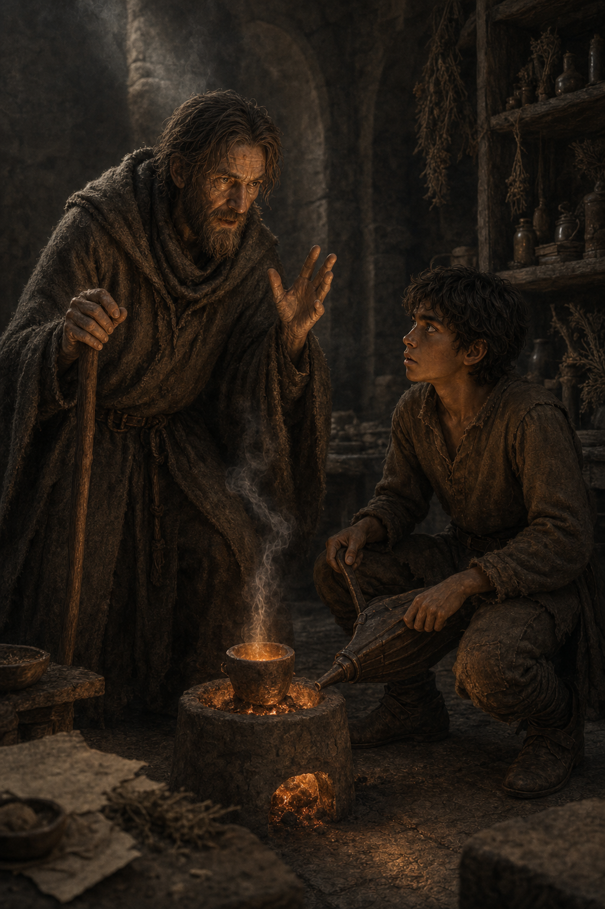

# 🖼️ 坩堝前的決斷 (Daring to Act Before the Crucible)

來源是《刺客正傳》（`book-farseer-trilogy_01`）第十一章〈冶鍊〉。沿海城鎮面對被冶鍊後歸來的人，開始各自選擇贖金、照料或殺戮；王室的遲疑沒有保留中立，反而把共同承擔的問題拆成每座小鎮各自的傷口。

畫面取切德與蜚滋守著坩堝的片刻。切德的憤怒不是要求一個漂亮的答案，而是在逼孩子看見：即使一項命令可能錯，統治者仍得讓人知道誰在承擔它、大家如何一起面對後果。坩堝的微光與薄煙把這份責任放得很小，卻也無法避開。

蜚滋沒有被畫成已懂得答案的成年英雄。他仍是正在長高的少年，握著風箱、被老師的話震住；這份停在行動前的驚愕，正是本章最誠實的重量。

