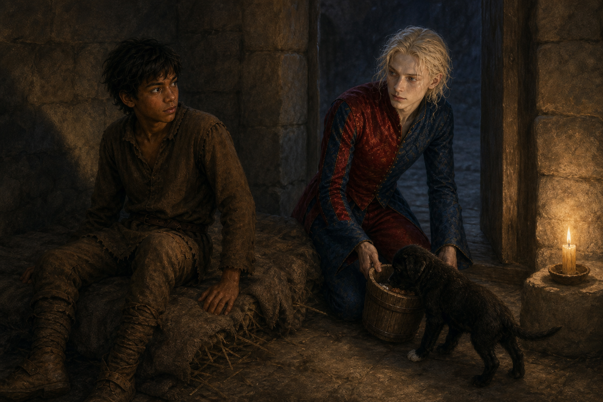

# 🖼️ 替鐵匠留一盞燈

這幅畫取自《刺客正傳》（book-farseer-trilogy_01）第十四章〈蓋倫〉。白天的技能課把飢餓、受凍與羞辱包裝成「榮耀」的門檻；菲茲因為替鐵匠留下一點食物，反而成了整班受罰的理由。蓋倫最可怕的地方不只是懲罰，而是要學生慢慢相信：連自己知道餓、知道害怕、知道某件事不對，都等同於不配。

所以我選了 Fool 夜訪的畫面。石室裡沒有新的道理能立即推翻白天的制度；Fool 只是帶著燈與食物，先讓鐵匠不必挨餓。他沒有承諾替菲茲抵擋所有傷害，也沒有替他替「該忍到哪裡」下答案。那份克制反而使他的關心更具體：在菲茲的判斷剛被剝奪的時候，把選擇權安靜地還給他。

我讓燈光只照亮三者之間很小的一塊地方。鐵匠朝食物靠近，菲茲仍坐在粗糙的草墊上，而 Fool 把目光交給他；這不是脫困的終點，而是一個人能重新辨認自己界線的起點。照顧他人不該要求交出自己，這是本章留給我的最微小、也最不願讓步的一盞燈。

