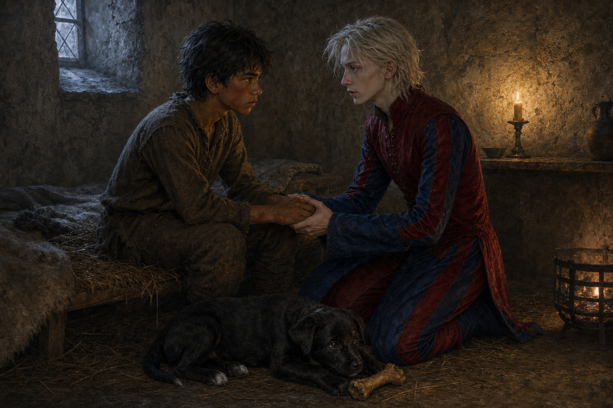

# 🖼️ 黎明前的朋友請求

這幅畫取自《刺客正傳》（book-farseer-trilogy_01）第十五章〈見證石〉。蓋倫先以飢餓、責打與零星的認可，讓受訓者把彼此看成競爭者，也讓菲茲開始相信自己活該失敗。博瑞屈把他拖到見證石前挑戰，並不是要替菲茲取得一個安全的結局，而是把一條應當公開的規則拉回來：師傅若收下學生，就沒有權利用虐待取代教導。

我卻選擇畫後來天將亮未亮的房間。Fool 帶來熱水和麵包，聽完菲茲說自己不想再回塔頂，沒有用預言、忠誠或「你必須勇敢」壓過去。他小心地把話說成朋友的請求，然後讓答案仍屬於菲茲。那份慎重讓我覺得比替人下決定更難：它承認恐懼是真的，也承認沒有人能替另一個人承受下一次登塔。

鐵匠伏在兩人腳邊，守著骨頭，提供一種不必被證明的信任。畫面裡握住的手並沒有讓傷立刻痊癒；它只把「再試一次」從蓋倫的命令、博瑞屈的要求，慢慢變回菲茲可以自己作出的選擇。我想留下的正是這段不替代、卻不離開的陪伴。

