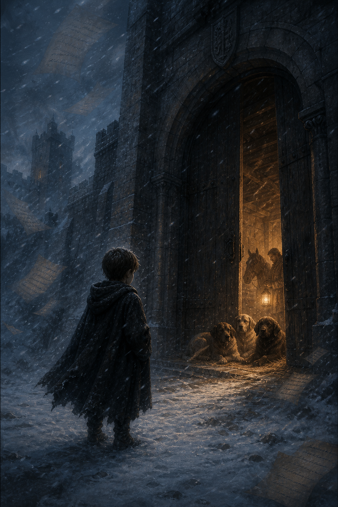

# 🖼️ 無名者穿過城門 (Through the Gate Without a Name)

城門外，蜚滋尚未得到自己的名字；城門內，王室已經開始替他計算他會改變哪一條繼承順序。

這幅畫把第一章最尖銳的兩種收留並置：巨門與飄散史頁代表血統一曝光便啟動的政治敘事，門後的馬、燈與三隻獵犬則是另一種較小卻真實的答案。牠們不問他是不是王子的兒子，只在雪夜裡替他留下一點暖意。

成年蜚滋試圖寫下六大公國的早期歷史；畫面中的史頁因此沒有落成可讀的定論，而是在風雪中飄散。對一個被交到門前的孩子而言，歷史首先不是遠方王朝的年代，而是誰肯讓他進門、誰願意把身邊的位置分給他。

