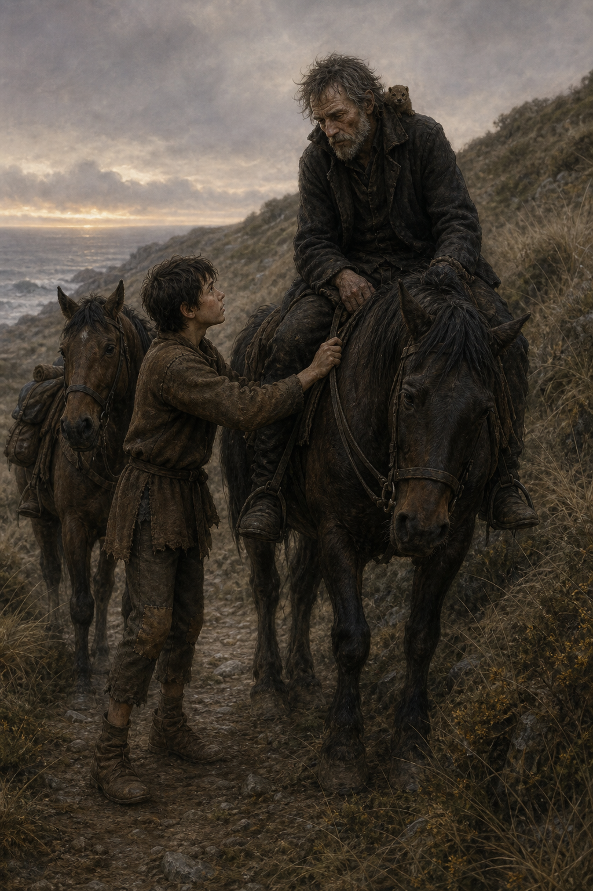

# 🌊 握住韁繩

第九章裡，切德最令人意外的本事不是易容，而是願意把自己放進市井的雜音裡。帽商、鈕扣販子與廚房裡的閒話，看似瑣碎，卻讓情報不只屬於高桌與密室。蜚滋也在賢雅夫人的小狗身上練習了另一種任務：不是替人做決定，而是找到對方願意自己承起責任的理由。

當冶鍊鎮的消息打斷夜晚，師徒便在海風裡連夜上路。切德的疲憊沒有讓他失去警覺，卻讓蜚滋第一次真切地看見：老師也是會撐不住的人。畫面停在蜚滋伸手扶穩韁繩的片刻；那不是英雄式的拯救，只是把一段太長的路，暫時由兩個人一起撐住。
