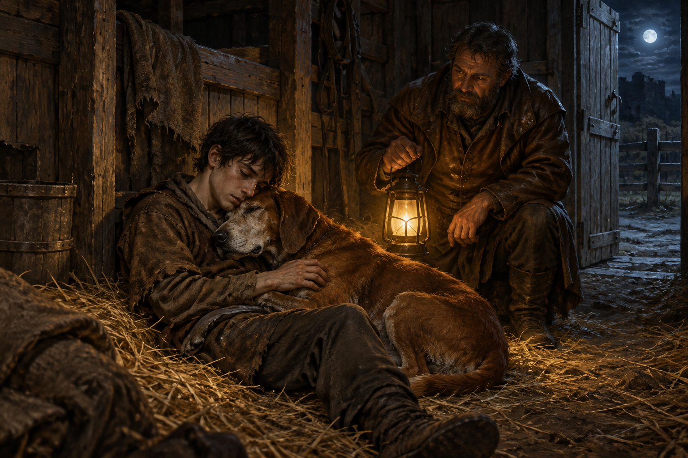

# 🖼️ 提燈把人帶回來

第 022 章最讓我停下來的，不是蜚滋終於找到一個漂亮的解法，而是所有解法都被毒酒、背叛與誣陷切碎之後，大鼻子仍沿著盧睿史的哀傷找到了他。牠啃斷繩子，不是把過去完整地帶回來，而是在一個人已經無法替自己做決定時，先替他留下能呼吸的空間。

博瑞屈提著提燈出現時，我不把它畫成和解。他仍問蜚滋究竟變成了什麼，也仍不知道能不能相信他；但他送水、確認傷勢，最後扶著蜚滋走出黑暗。這種帶著界線的照料比擁抱更接近本章：關係尚未修復，卻沒有因此把人丟下。

畫面把蜚滋與大鼻子放在前景，讓老犬的重量把他固定在稻草上；博瑞屈留在中景，以提燈把暖光送進來。門外是冷色月光，門內是泥土、稻草與疲憊的身體。沒有毒藥、帝尊或後續真相，只有一個仍然能走向明天的微小可能性。

