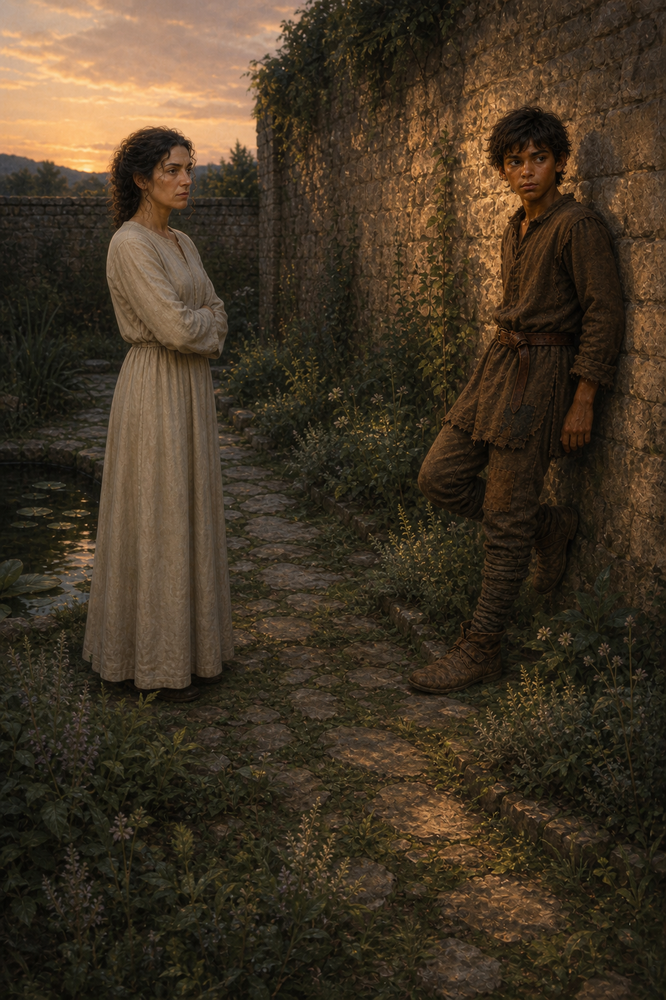

# 🖼️ 花園裡遲來的提問

這幅畫取自《刺客正傳》（book-farseer-trilogy_01）第十二章〈耐辛〉。蜚滋在女人花園裡被一位陌生女子追問：他會不會唱歌、跳舞、背誦史詩？他只知道自己從未被教過這些，還不知道對方正是父親駿騎的妻子。花圃、池水與暖牆本該安撫酒後暈眩，卻讓這場相遇顯得格外無處可逃。

我把兩人之間的石徑保留下來，因為耐辛的提問既像責備，也像第一次認真看見他被虧欠了什麼。她想替他補上王室教育，卻只能用命令的語氣接近；蜚滋則只能把每個否定答得誠實而困惑。這不是立刻形成的親情，而是一份遲來的關心第一次碰到已經學會防備的孩子。

章末切德說王後花園的四壁之間他無能為力，使此刻的花園也帶上一層預兆。能走進去不必然表示自由：耐辛爭來的教育和精技訓練，會讓蜚滋更靠近父親的血脈，也更靠近蓋倫的敵意。因此畫面保留暮色與距離，而不把它畫成一個已經和解的家庭場景。

