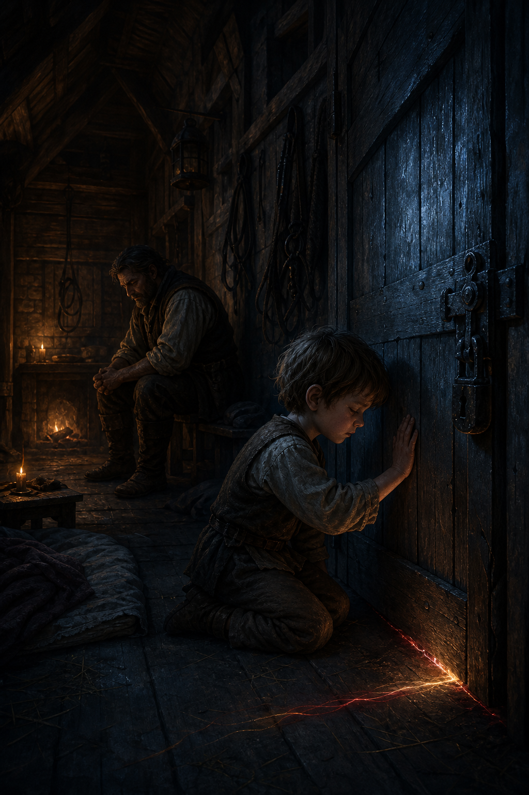

# 🖼️ 保護的鎖 (The Lock of Protection)

博瑞屈沒有把鞭子揮向大鼻子，卻仍以「讓孩子成為人」的信念，把牠帶離蜚滋。對他而言，那是阻止原智吞噬孩子的必要選擇；對蜚滋而言，卻是唯一不用先解釋血統、名字或位置的同伴被奪走。

畫面讓兩人留在同一個房間，卻隔著截然不同的世界：孩子跪在鎖門前，門縫下的紅金細線象徵正在消失的共享感官；博瑞屈則坐在將熄的火邊，沒有勝利，也沒有得到諒解。他替孩子備好食物和床，卻同時成了將他鎖住的人。

第二章最令人不安的不是明確的惡意，而是照料和恐懼可以由同一雙手做出。當某種天賦先被判定為會使人失去人性，孤立便會被誤認為救贖。

