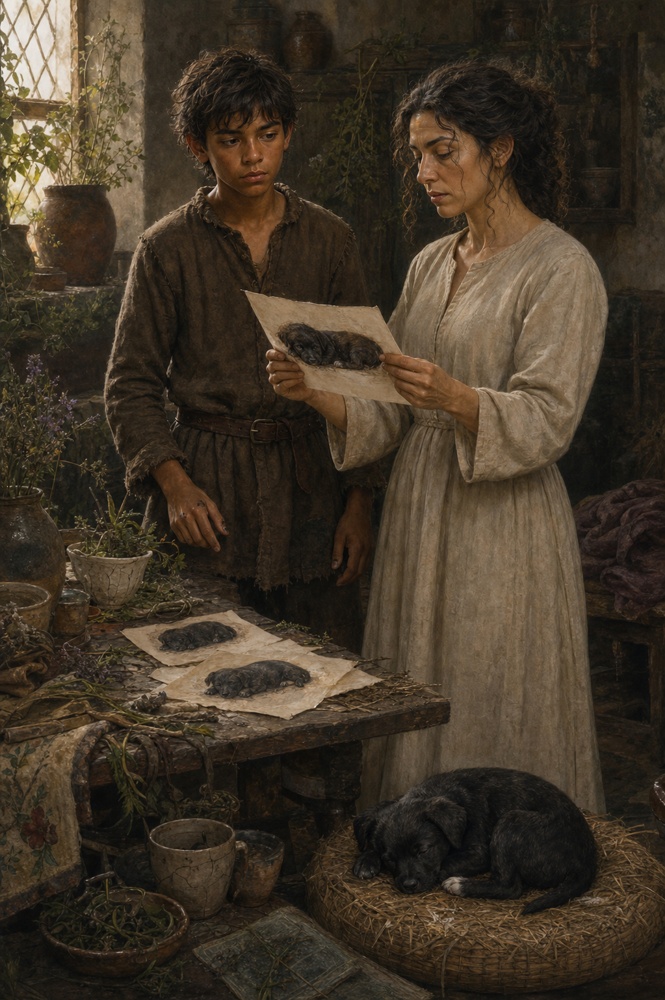

# 🖼️ 畫下鐵匠

這幅畫取自《刺客正傳》（book-farseer-trilogy_01）第十三章〈鐵匠〉。耐辛夫人急著讓蜚滋學會音樂、詩詞或禮儀，卻總在他剛找到一點節奏時換一件事；蜚滋於是自己向費德倫借來畫具，想畫下剛送到身邊的黑色幼犬鐵匠。他一張張失敗，最後才明白自己必須少畫一些，去看陰影如何托出小狗的背與後腿。

我把耐辛停在畫前的驚訝保留下來。她原先以為這些畫出自某個可供她利用的能人，直到蕾細告訴她畫者就是蜚滋。那個瞬間沒有解決她對駿騎、蜚滋母親與失去孩子的痛；它只讓她第一次看見眼前少年有一種不必由她替他發掘的能力。蜚滋也沒有因此變得坦然，他仍帶著沾在指尖的顏料和把紙交出去的窘迫。

畫面前景讓鐵匠安睡，因為牠才是這場相認的真正起點。牠不是大鼻子的替身，而是蜚滋重新願意把注意力、喜悅與照料交給另一個生命的證據。耐辛的禮物本可能變成一堵牆，但在畫紙與熟睡的小狗之間，暫時成了一座還很脆弱的橋。

