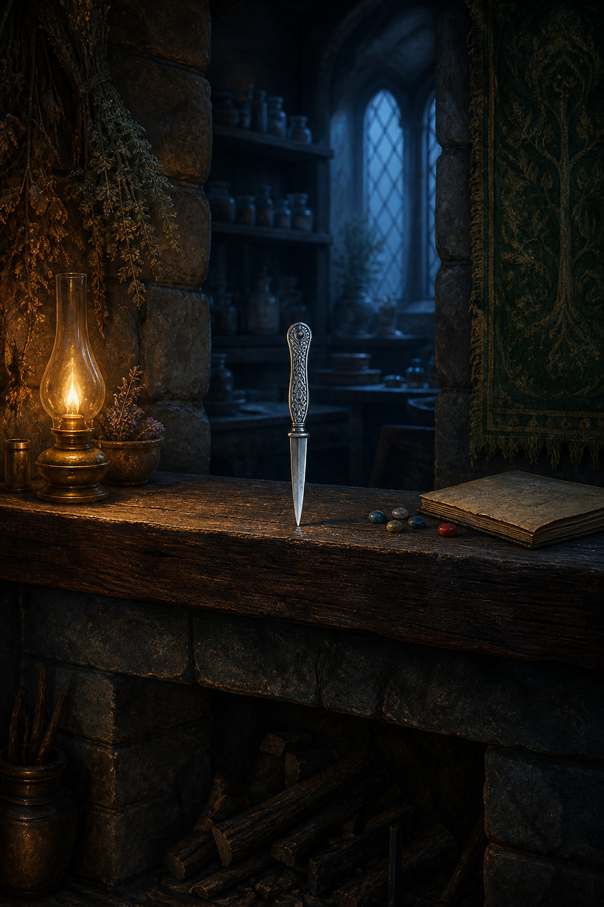

# 🖼️ 壁爐架上的小銀刀 (The Silver Knife on the Mantel)

第五章裡，切德要蜚滋從黠謀國王的房間拿走一件東西，以驗證他的技巧與服從。蜚滋明明做得到，卻拒絕了：他認為那會違背自己對國王的承諾。這份說不清的堅持讓他失去切德幾天，也讓他重新墜回最深的孤單。

後來切德承認孩子是對的，國王也坦白考驗出自自己。蜚滋便從國王的桌上取走一把雕花小銀刀，並在重新上課的夜裡，沉默地把它插進切德的壁爐架。那不是偷竊的得意，也不是單純的報復；它把那場傷人的考驗變成一條不能被抹平、卻能共同看見的界線。

畫中的油燈和黎明藍光讓空房間同時留著冷與暖。銀刀旁的彩色石頭指向切德的記憶遊戲，藥草則提醒人刺客的技藝可被用於照料、欺瞞或傷害。蜚滋在這一章學到的，不只是如何潛入房間，而是如何在能做到的事面前，仍替自己選擇不做什麼。

