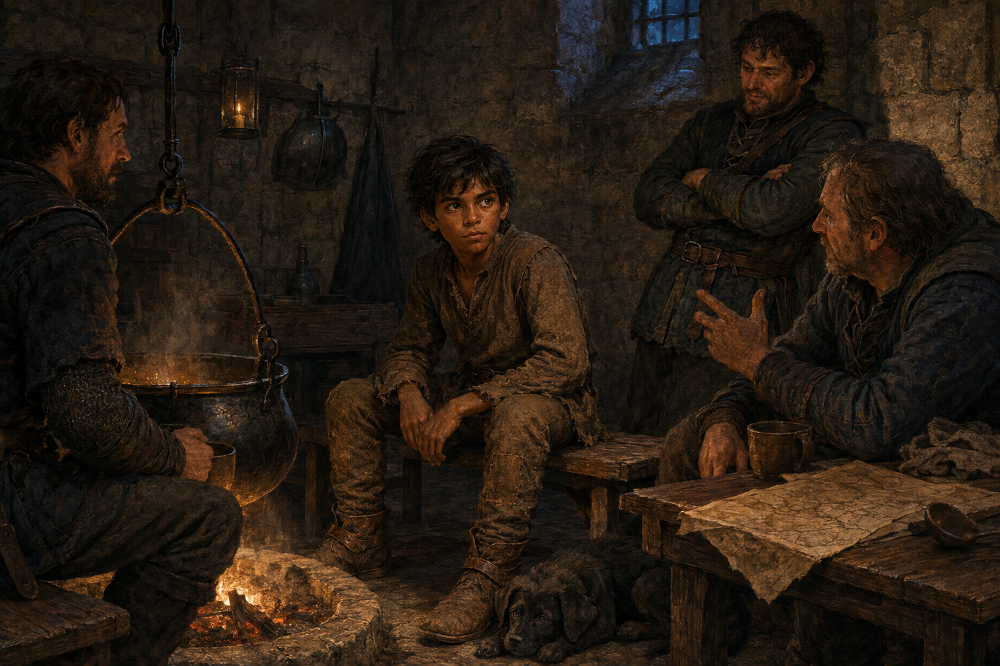

# 🖼️ 燉鍋與守望

這幅圖取自《刺客正傳》（`book-farseer-trilogy_01`）第十六章〈課程〉。見證石後，蓋倫帶著瘀傷回到塔頂，仍試圖把精技課程維持成服從的儀式；蜚滋看見他也只是凡人時，感到的不是勝利，而是自己曾信任那套恐懼的羞愧。

離開寒冷的海灘後，蜚滋回到城堡守衛室。一口隨時添水、添肉和蔬菜的燉鍋，讓受傷的少年可以先把自己當作需要照料的生命；守衛談論邊境、航路與惟真的政治婚事，也讓他重新聽見不在高塔裡的實際知識。

畫面把鐵匠安放在蜚滋靴邊。牠不是替主人說出答案，而是以飢餓、溫度與陪伴把他拉回具體的世界：真正的連結不替人決定，卻讓人在最孤立的時候還聽得見有人等待他回來。

