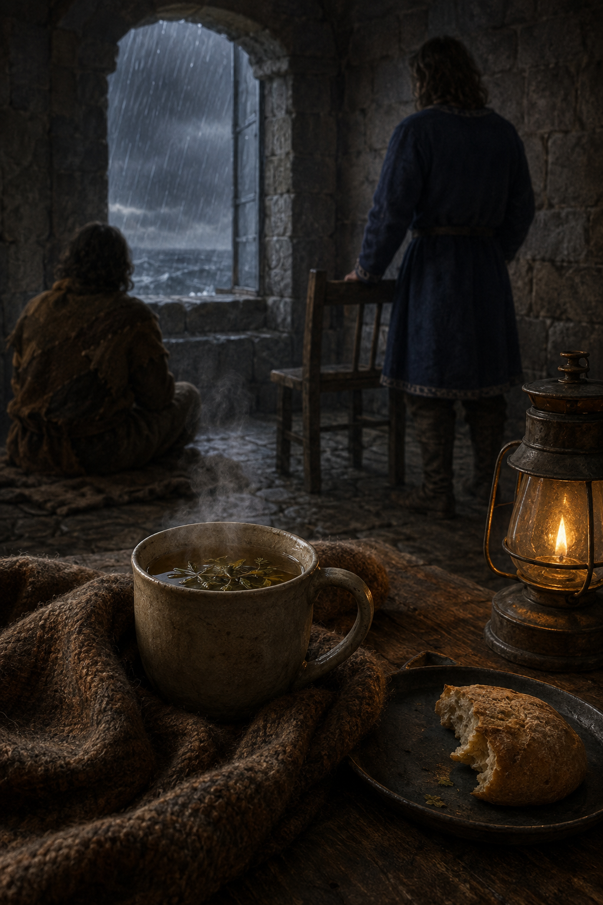

# 🖼️ 風暴塔房的茶

這幅圖取自《刺客正傳》（`book-farseer-trilogy_01`）第十八章〈暗殺〉。惟真日復一日以精技抵禦紅船，幾乎忘了吃飯與休息；蜚滋便掃去塔房灰塵、添上靠墊與百里香，並調好切德留下的濃茶。

我把人物留在背側，把茶杯、毛毯、雨窗與空椅放到前景。這不是把他們的親近畫成沒有代價的救贖：惟真從蜚滋身上取走力量後仍必須承認那個錯誤，而蜚滋的照料也仍受王室關係規訓。可是兩人共同待在這間房裡，讓耗竭不再被藏成理所當然。

