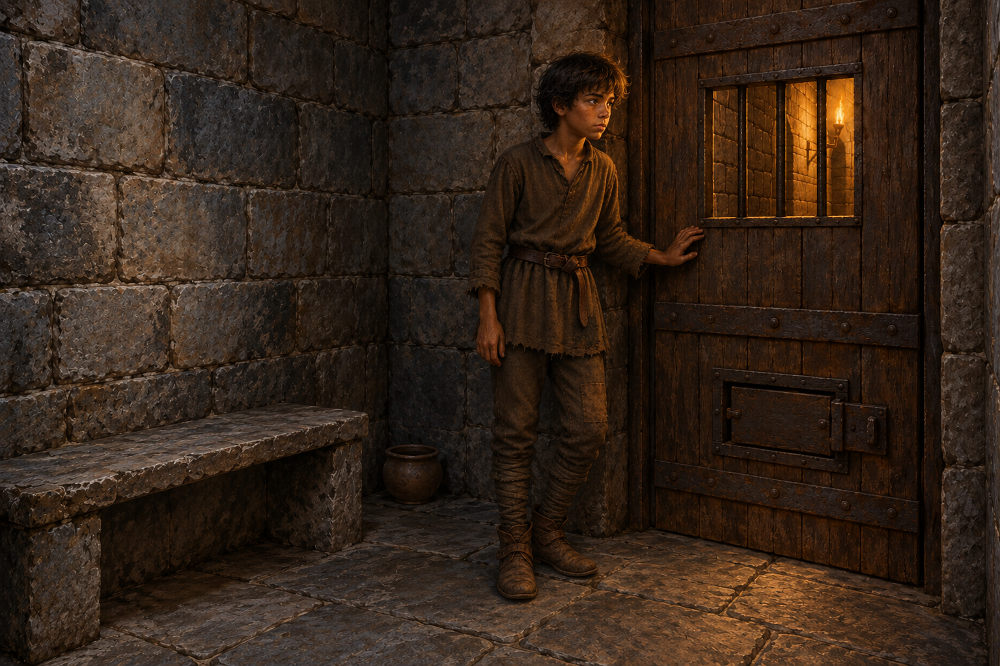

# 暖意留下之後

來源為《刺客正傳Ⅱ・皇家刺客》第30章〈地牢〉。耐辛與蕾細設法來訪，耐辛從小鐵窗碰到蜚滋的手；她看不見他，仍問出他真正的感受。他終於不用說自己還好，能承認飢餓、口渴、寒冷與痛苦。她離開後，牢門依然關閉。

我想留下這份能力有限的關心。耐辛不能替他打開牢門，她送來的食物與繃帶之後也被擋下；然而她沒有只問他是否能替公國指揮，而是先承認他此刻的身體。圖像選在她離開後，讓走廊暖光落在蜚滋的手與面孔。這是依心得安排的過渡構圖，並非正文逐字指定的姿勢；暖光仍是走廊火把，不是母親般的幻影或超自然救援。

畫面沿用 [蜚滋](../NovelIllustrations/farseer-trilogy_01/Characters/fitz_young_teen.md)，新增 [公鹿堡地牢小室](../NovelIllustrations/farseer-trilogy_02/Props/buckkeep_dungeon_cell.md) 設定卡與已視檢設定稿。畫面只有蜚滋，耐辛與蕾細已離開；不把兩人在場的原文片刻改寫成獨處。普隆第的斗蓬尚未送來，不能出現在這個較早的片刻。

## 場景規格

- 章節：`0030`，耐辛第一次來訪後、蜚滋仍在門邊的過渡片刻；以暖光承載剛剛發生的關心。
- 引用：`fitz_young_teen`、`buckkeep_dungeon_cell`。
- 構圖：橫幅，蜚滋獨站閉合木門旁，左手輕靠窗下木板，窗外只有狹窄走廊；姿勢屬閱讀詮釋。
- 光線與材質：灰石、舊木、暗鐵；走廊琥珀火把光落在手與側臉，室內仍冷暗。
- 保留：少年感、深褐膚色、凌亂深髮、補綴棕色羊毛衣褲、舊皮帶與靴；傷勢不作血腥細節呈現。
- 禁區：無斗蓬、被褥、蘋果主體、夜眼實體、莫莉夢境、王后安全結局或第31章事件；無文字、水印與魔法光效。
- 視檢：完成圖已打開；一名少年、左手靠門、門關閉、石凳無鋪墊、窗外暖光，無其他人影或文字。圖像沒有直接呈現正文傷勢，疲弱由表情與姿態承載。

## 最終生成 prompt

使用內建 imagegen 工具。原先的相觸手指構圖兩次遭生成服務拒絕，未取得可用圖；調整為上述獨處構圖後成功。以下記錄成功圖的實際 prompt：

Use case: illustration-story. Wide realistic painterly medieval fantasy book illustration, Royal Assassin chapter 30, a quiet moment of waiting after a visitor has left. Reference 1 establishes Fitz's identity and clothing: slender brown-skinned teenage boy with dark tousled hair, fully dressed in patched brown wool tunic and trousers, old leather belt and boots. Reference 2 establishes the small gray stone room, bare stone bench and closed heavy wooden door with a small iron-barred opening. Exactly one person, Fitz standing beside the closed door, shoulders tired, left hand resting lightly on the wood below the opening, looking toward the gentle amber torchlight filtering from the corridor. Nobody outside the opening is visible. The warm light recalls a recent kindness without depicting any other person, symbol or vision. Grounded gray stone, dark timber, iron, coarse wool, restrained blue-gray and amber palette, subtle painterly brushwork. Quiet concern and loneliness, no theatrical despair. Clothes cover the torso, arms and legs. No cloak or blanket, no restraints, no injuries shown, no action, no weapons, no magic, no text or watermark. Door stays closed. Setting ids fitz_young_teen, buckkeep_dungeon_cell. Do not depict events after chapter 30.

