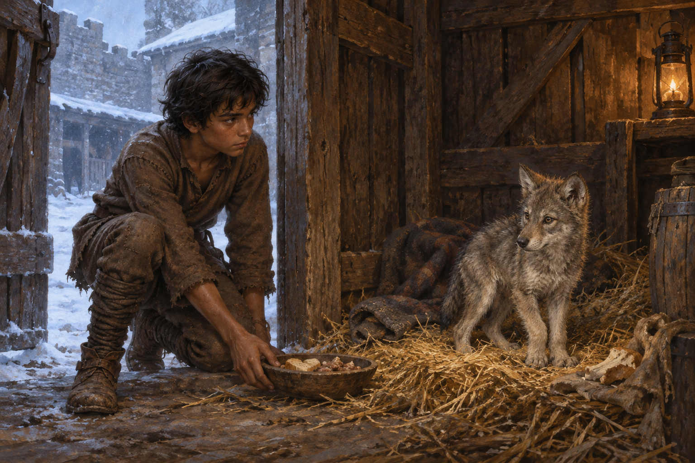

# 🖼️ 雪中暫借的家

## 閱讀節點

第五章〈孤注一擲〉裡，蜚滋在公鹿堡冬日的孤獨裡，一面練習讓自己不再困在失意與等待莫莉的念頭，一面祕密照料被關在小木屋的小狼。他知道原智會使牽繫過深，也害怕博瑞屈發現；但每一次帶來食物、乾草與舊馬毯，都讓小狼從飢餓與警戒裡慢慢學會等待他。

這幅圖選在他把食物放到門邊的瞬間。小狼沒有被牽繩、也尚未撲向他；牠留在稻草與舊毯間，仍把自己保留為一隻能回到野地的狼。蜚滋也沒有跨進去抱住牠。兩者之間的距離讓照料不是佔有，而是承認眼前的飢餓不能被忽視。

## meadow 的心得

我讀到的「孤注一擲」不是一個英雄式的豪賭，而是每一天都要重新決定的一小步。蜚滋一直告訴自己春雪融化後會放走小狼，這份承諾裡同時有誠意和逃避：他想讓牠自由，也想否認自己已被牠改變。可是小狼記得他口袋裡的薑餅、在他靠近時等待，已使關係成為事實。

門外的雪是仍可離開的世界，屋內的燈光卻不是馴服的獎賞。它只照亮一個暫時可以活下去的地方。這也是我想從本章留下的分界：真正的照顧不承諾把對方留在身邊，而是即使害怕責任的重量，也不把需要幫助的生命看成可以略過的背景。

## 場景規格與邊界

- `chapter`: `0005`
- `narrative_moment`: 蜚滋在公鹿堡馬廄後的廢棄小木屋門邊放下食物；小狼留在稻草、舊馬毯與微弱燈光裡，以警覺但開始信任的目光看他。
- `references`: `fitz_young_teen`, `wolf_cub`
- `composition`: 橫幅中景；蜚滋在左側門邊半跪，把食物放在地上；小狼位於右側稻草堆上，兩者以門框、食物碗與視線形成距離。門外能看見藍灰色雪地與模糊馬廄外牆。
- `lighting`: 門外是冷藍灰的冬雪反光，屋內只由一盞低矮油燈提供克制的琥珀色；不以原智或精技特效取代兩者的眼神。
- `must_preserve`: 蜚滋的少年感、深色蓬髮、磨舊棕色羊毛衣褲、皮帶與舊靴；小狼的灰褐冬毛、瘦小但開始恢復的身形、警覺耳朵與真實狼的解剖；粗木、稻草、舊馬毯、潮濕黑石與磨舊皮革的寫實奇幻書籍插畫質地。
- `must_not_reveal`: 不畫小狼的後續名字、能力、傷痕或命運；不畫博瑞屈、莫莉、王室人物或其他可辨識角色；不畫項圈、牽繩、籠子、武器、王室徽記、戰鬥、血、魔法光效、可讀文字、標誌或水印。
- `visual_check`: 圖中只有蜚滋與小狼；兩者均符合設定稿的年齡／物種與服裝／毛色；雪地與小木屋的冷暖光、食物被放下而非餵食或馴服的距離均可辨識；未見文字、水印或後續劇透。

