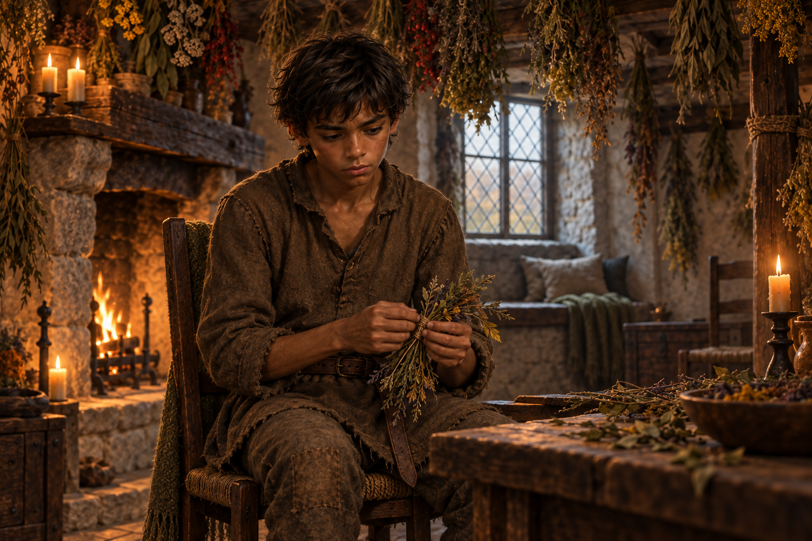

# 🖼️ 苦味藥草間的遲來理解

《刺客正傳Ⅱ・皇家刺客》第 18 章〈古靈〉裡，蜚滋在耐辛的藥草房幫忙懸掛秋日採來的葉束，聽見莫莉曾把點彩葉當作漱口用的草藥。他終於意識到，她一直擔心兩人不可能擁有的未來，卻仍把每一個當下交給他；他接受了她的忠誠，卻沒有認真看見她付出的風險。

畫面只停在蜚滋低頭繫藥草的片刻。垂掛的葉束把房間變成一片倒懸的草原，他手上的動作停了下來，像是第一次明白自己必須為這份親密承擔責任。莫莉不在畫面裡，藥草也不被畫成有確定療效的藥方。

我喜歡這個醒悟不是一段漂亮的承諾，而是注意力終於回到另一個人身上。蜚滋仍不知道怎麼改變處境，但至少不再把莫莉的沉默誤認為她沒有代價。

