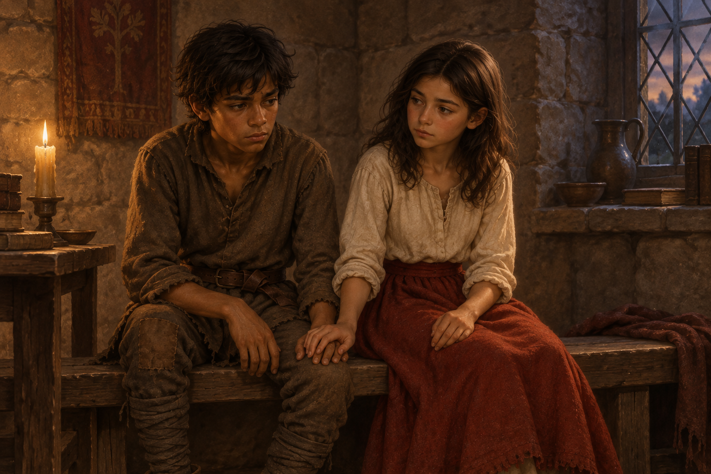

# 🖼️ 苦果與相握之手

《刺客正傳Ⅱ・皇家刺客》第 20 章〈災難〉裡，莫莉把耐辛曾愛著博瑞屈、而博瑞屈選擇效忠蜚滋父親的故事告訴蜚滋。她看見蜚滋也把王室的責任擺在愛人之前，問他是否願意與她一起離開。兩人沒有因此得到答案，但在談話之後仍坐回彼此身旁。

畫面停在他們坐在石室長凳上、手輕輕相疊的時刻。蜚滋低頭思索，莫莉安靜地看著他；兩人的衣著仍是日常的補綴羊毛與暗紅裙裝。微弱燭光帶來片刻安慰，表情和彼此的距離仍保留著未解的前途，不把這一刻畫成承諾、出走或和解。

耐辛與博瑞屈的舊情讓蜚滋看見忠誠如何在一代又一代人身上留下苦味。莫莉沒有替他消除選擇的重量，而是把他一直沒看懂的相似處說了出來。我想留下的是爭執後仍願意靠近的手，和它所不能代替的決定。

