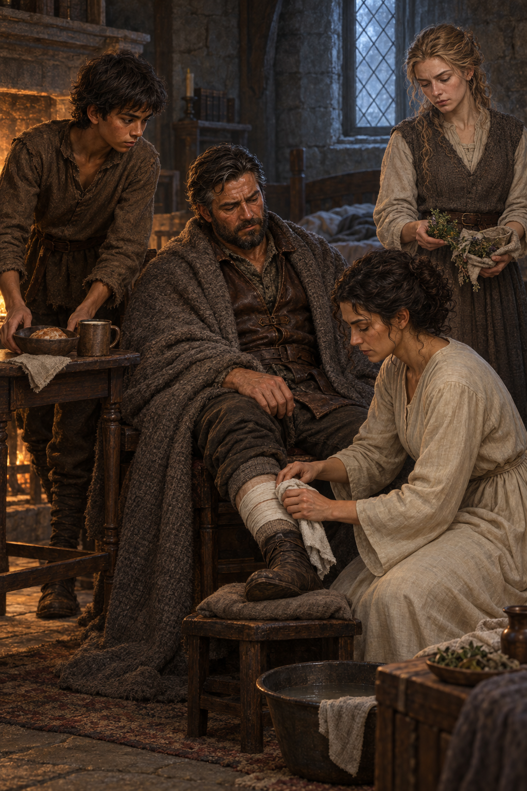

# 🖼️ 疲憊裡的照料

## 閱讀節點

《刺客正傳Ⅱ・皇家刺客》第 22 章〈博瑞屈〉裡，博瑞屈帶著傷腿與旅途的寒冷回到公鹿堡。蜚滋把他帶回自己的房間，送上麵包與溫牛奶；耐辛夫人和蕾細取來藥草與乾淨的布，耐辛親手替他清理舊傷。珂翠肯也帶來自己熟悉的草藥，加入她們的照護。畫面停在這群人圍著椅子各自伸手幫忙的時刻。

## meadow 的心得

本章沒有立刻解開惟真遇襲與消息中斷的疑問。博瑞屈能平安回來，卻虛弱到必須借蜚滋的手支撐；他帶回的消息仍讓人擔心惟真的處境。房裡能做的事很小也很具體：熱食、溫水、藥草和重新包紮。

蜚滋曾以為耐辛和博瑞屈的往事只是大人之間糾纏的舊傷，這一刻卻看見耐辛如何不聲張地照料他。珂翠肯與耐辛交流草藥時，關心也暫時越過了身份與猜疑。我想留下的是人們還沒有答案時，仍願意先替彼此清理傷口。

## 場景規格與邊界

- `chapter`: `0022`
- `narrative_moment`: 博瑞屈坐在蜚滋房內休息；耐辛夫人替他清理傷腿，蜚滋送上食物，珂翠肯分享草藥。
- `references`: `fitz_young_teen`, `burrich`, `nassin`, `ketricken`
- `composition`: 直幅中景；博瑞屈居中坐在椅上，耐辛蹲在傷腿旁，蜚滋從左側送上食物，珂翠肯在後方遞來草藥。四人以自然照料動作連成一室，不擺成肖像隊列。
- `lighting`: 冬日藍灰窗光與柔和壁爐暖光並存，保留城堡石牆、舊木家具、羊毛、皮革與亞麻質感。
- `must_preserve`: 蜚滋仍是穿補綴棕色羊毛的少年；博瑞屈是疲憊、蒼白且有鬍子的馬廄總管；耐辛保持深色捲髮與樸素淺色衣裙；珂翠肯採簡單而實用的室內衣著。傷腿僅以乾淨布條遮覆。
- `must_not_reveal`: 不出現可見懷孕、宣告或相關暗示；不描繪攻擊者、遇襲過程或未確認陰謀，不加入精技／原智特效、血腥傷口、可讀文字或水印。
- `visual_check`: 畫面呈現四名主要人物的照料合作，傷勢非血腥，並避開珂翠肯尚未公開的消息與後續劇情。

