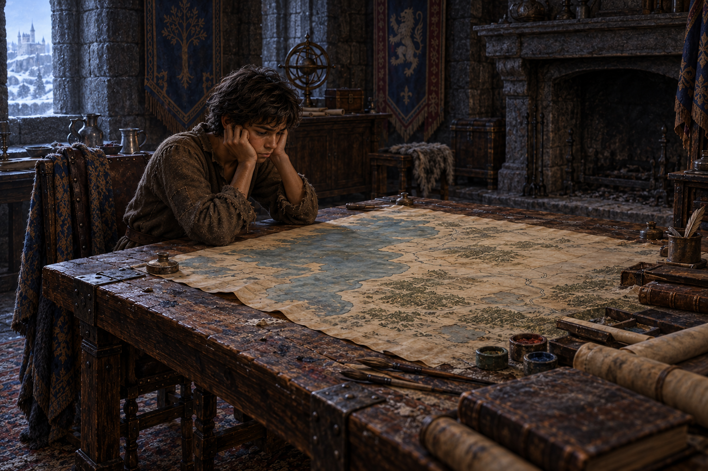

# 🖼️ 空桌前的重任

來源為《刺客正傳Ⅱ・皇家刺客》（`book-farseer-trilogy_02`）第 28 章〈叛變和賣國賊〉。蜚滋回到惟真的書房，冷掉的壁爐、桌上的墨漬與乾裂顏料讓他想起曾經在此承擔王國的人。他捧著頭求援，隨後首次不靠他人完成技傳；惟真回應了，卻無法及時回到公鹿堡。

我想把這一刻畫成責任仍未交出去的重量。桌子留下工作的痕跡，並不保證桌子的主人能回來；蜚滋收到信任，也不能因此把往後的選擇說成已有答案。這個獨坐片刻讓我看見他在得到公爵支持以前的需求：先有人告訴他該怎麼做。然而這份需要，與後來必須親自判斷的承諾，並不能互相代替。

畫面沿用 [蜚滋](../NovelIllustrations/farseer-trilogy_01/Characters/fitz_young_teen.md) 與 [惟真地圖室](../NovelIllustrations/farseer-trilogy_02/Props/verity_map_room.md) 設定，按本章將室內改成冷、久未使用的狀態。顏料和廢筆只是既有工作空間的使用痕跡，不作有固定外型或隱藏用途的新道具。畫面不判定蜚滋是否叛國，也不預告出逃與權力安排的結果。

## 場景規格

- 章節與片刻：`0028`，蜚滋在惟真書房坐下、以雙手捧頭求援，技傳尚未以任何可見方式呈現。
- 設定引用：`fitz_young_teen`、`verity_map_room`；本章沒有新增可辨識角色。
- 構圖：橫幅，少年坐在地圖桌的一端，桌面保留大段無人使用的空間；冷壁爐位於後景。
- 光線與情緒：冬日藍灰窗光、灰褐木與石；疲憊、思念、尚未找到下一步。無暖爐火。
- 必須保留：蜚滋的深褐膚色、凌亂深髮、纖瘦少年感、補綴棕色羊毛衣與舊皮革；地圖桌、石牆與壁爐的空間關係。
- 不可出現：惟真人影、偷聽者、冠冕、即位、逃離成功、魔法光效、可讀文字、水印、未讀章節資訊。
- 視檢：已打開完成圖；一名深褐膚色少年、雙手捧頭，服裝沿用設定，壁爐冷暗、桌上有舊筆和顏料，無可讀文字、光效或其他人物。

## 最終生成 prompt

使用內建 imagegen 工具，實際 prompt：

Use case: illustration-story. Create one finished wide painterly realistic fantasy book illustration for chapter 28 of Royal Assassin. Input image 1 is character identity reference fitz_young_teen_v1; input image 2 is room layout/material reference verity_map_room_v1. One slender brown-skinned teenage Fitz, tousled dark hair, patched brown wool tunic and trousers with worn leather belt and boots, seated at Verity's scarred map desk, elbows on the table, head cradled in both hands, quietly asking the absent Verity for help. Keep the stone room, broad map table and fireplace layout of reference 2 but make it long-unused: fireplace completely cold and dark, no candles lit, no fire, pale winter window light, worn discarded quills, dried cracked pigment in small pots, ink stains and faint dust. The simple map has abstract coast contours, absolutely no readable lettering. Wide composition with a large unoccupied tabletop, the boy off-center and seen in three-quarter profile; his hands and shoulders convey grief and responsibility rather than terror. Muted blue-gray and brown, subtle painterly brush texture, intimate quiet atmosphere, grounded medieval materials. Verity is absent. Exactly one person; no other figures or apparitions, no crown, no weapons, no magic effects, no glowing eyes, no text or watermark, no depiction of future escape outcomes.

