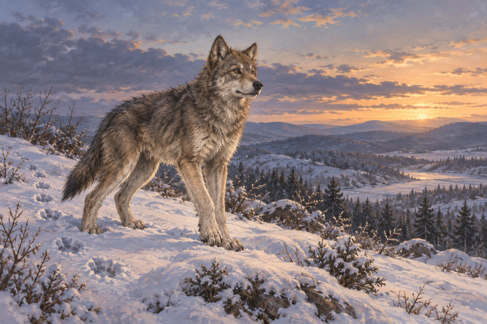

# 我在兄弟這裡

來源為《刺客正傳Ⅱ・皇家刺客》第32章〈處決〉章末。蜚滋在牢房服下博瑞屈留給他的葉包藥草，轉向夜眼的感知；暮色將至，狼起身、抖動身體，兩人開始狩獵。本圖呈現狼這一側的感官經驗，不把未揭曉的肉身命運畫成已完成的逃離。

夜眼反覆催促蜚滋離開受困的身體，並非把他推向獨自消失，而是叫他來到自己身邊。我的心得在於這個方向：蜚滋往內縮，夜眼卻一直說「過來」。畫面只用一匹狼承載他們的「我們」，保留共同感受而不發明另一個可見身體。

沿用 [夜眼](../NovelIllustrations/farseer-trilogy_02/Characters/wolf_cub.md) 的灰褐冬毛、立耳、敏銳眼神與成長中的纖健輪廓；本章按文字呈現矯健身形，不把中性幼狼稿固定為不會長大的幼犬。雪坡與稀疏灌木是章內已知的一般環境，不作固定位置、隱藏通道或新場景地標，故不另建重複的雪景設定卡。

## 場景規格

- 章節與片刻：`0032` 章末，夜眼在暮色雪地起身，準備狩獵；動作選取於文字明示的抖身與出發之間。
- 引用：`wolf_cub`；唯一可見主體是夜眼，蜚滋沒有可見人影或另一具狼身。
- 構圖：橫幅，一匹灰褐狼站在雪坡，身體側向前路、頭稍抬起，留出開闊的前方；足跡延伸於身後。
- 光線：冬日暮色的冷藍灰，遠處天際微淡金；自然光而非魔法光效。
- 保留：灰褐冬毛、較深背毛、立耳、敏銳而非發光的眼睛，矯健成長中的狼體；嘴上不再有豪豬刺。
- 禁區：無人體、幽靈、第二匹狼、藥物、傷者、刑場、獵物屍體、變形光效或第33章結果。無文字、水印。

## 視檢

完成圖已打開：只有一匹纖健灰褐狼，四肢與尾巴自然、眼睛不發光、嘴邊無豪豬刺；雪丘有足跡，暮色天際開闊，無人體、獵物、文字或水印。遠景是一般雪丘與林帶，不作具名地點的客觀地圖。

## 最終生成 prompt

使用內建 imagegen 工具，實際 prompt：

Use case: illustration-story. A finished wide painterly realistic fantasy book illustration for Royal Assassin chapter 32, the closing moment of shared wolf perception before a hunt. Reference image is Nighteyes, setting id wolf_cub: preserve gray-brown winter fur with darker back, alert upright ears, natural amber-brown eyes, lean youthful wolf proportions. In this scene he is a growing agile young wolf, not a tiny puppy, dog or giant beast. Exactly one wolf stands on a quiet snow-covered hillside at dusk, having just risen, body angled toward the open landscape and head lifted slightly, ready to move. A short trail of pawprints behind him, sparse winter shrubs, soft distant hills and pale gold fading into blue-gray twilight. Fitz shares this wolf's perception but has no visible body here: no human, ghost, second wolf or transformation effect. Focus on the living wolf's alert presence and open space ahead, conveying brotherhood and tentative relief without claiming rescue is complete. Realistic anatomy and winter fur, grounded snow textures, subtle painterly brushwork matching the reference. No porcupine quill in the muzzle, no prey, no violence, no buildings or landmark inventions, no glowing eyes, no magic, no text or watermark. No events after chapter 32.

