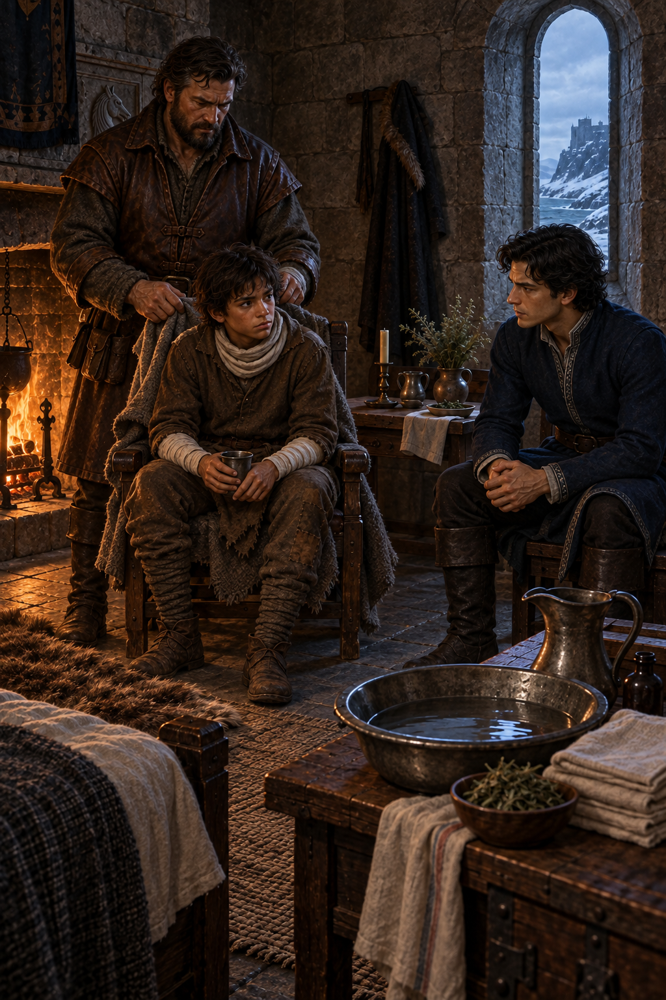

# 🖼️ 清理之後仍留下的責任

## 閱讀節點

第十三章〈狩獵〉先讓蜚滋與惟真在精技連結裡談信任與私密，再把兩人帶到雪地裡追蹤被冶鍊者。蜚滋殺死了襲擊者，卻救不回被拉扯的小女孩；回到房間後，博瑞屈一邊替他清理與包紮，一邊質問惟真為何讓他承擔這場秘密戰爭。

## meadow 的心得

我沒有把這一章畫成勝利的狩獵，而是畫成清理之後仍無法被洗掉的責任。壁爐讓蜚滋能坐下，博瑞屈的手讓他的身體重新有了邊界，惟真則坐在冷光那一側，承受「需要一個人」與「那個人仍然是人」之間的衝突。

蜚滋最後說「他們是我的人民」，不是因為王室的命令突然變得無害，而是因為他看見了一個具體孩子的死亡，決定把這份痛苦認作自己的關係。畫面因此保留三人的距離：照料不是代替選擇，信任也不是撤銷警告；責任只有在承認代價後仍由自己說出口，才不會只是把人變成工具的另一個名字。

## 場景規格與邊界

- 章節：`0013`〈狩獵〉；敘事時刻是蜚滋回到惟真房間、接受博瑞屈照料並面對惟真與博瑞屈的責問。
- 主體：蜚滋坐在壁爐旁，沿用少年期的深褐亂髮與磨舊棕色衣物；博瑞屈站在他身後整理乾淨繃帶；惟真坐在雪窗與冷光一側，穿沿用的深藍服裝。
- 構圖：蜚滋在暖光中央，博瑞屈形成保護性的垂直支撐，惟真與他們隔著小桌保持可見但不封閉的距離；前景以清水、藥草與折布象徵「清理不能等於忘記」。
- 色彩：壁爐橘光對照窗外藍灰冬光，棕色皮革、深藍布料、灰石與亞麻構成低飽和的沉重畫面；不使用血紅作視覺焦點。
- references：`fitz_young_teen`、`verity`、`burrich`、`verity_room_after_hunt`。
- 不畫小女孩、母親、被冶鍊者、屍體、戰鬥或血腥傷口；不加入後續斧頭訓練、紅船事件、王室答案或精技特效，不把本章改寫成英雄式勝利。

