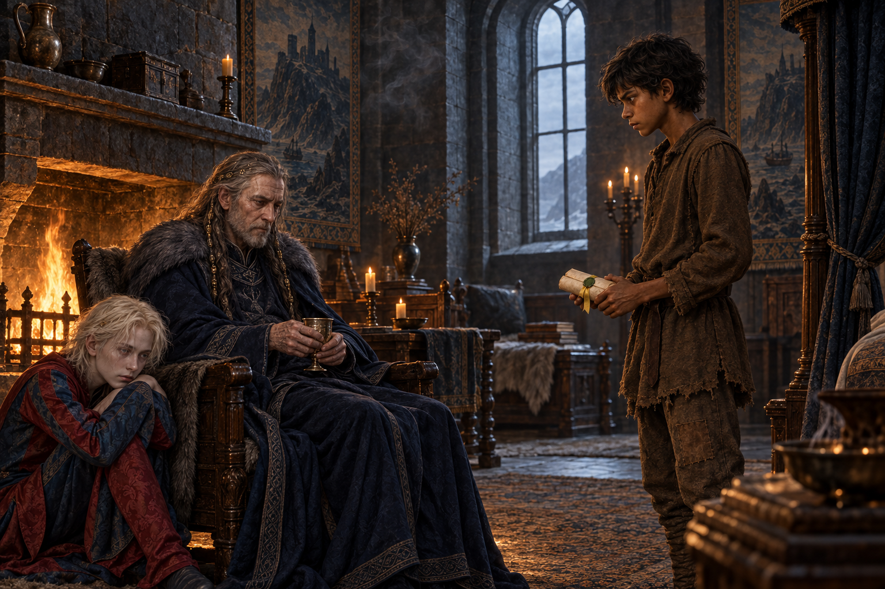

# 🖼️ 捲軸與顫抖的手

《刺客正傳Ⅱ・皇家刺客》第 17 章〈插曲〉把蜚滋帶回黠謀的臥房。國王把婕敏捎來的捲軸交給他，也說自己沒有摒棄他；但他仍把一段婚姻安排稱作「為你好」。蜚滋看見國王消瘦、握杯的手發顫，怒意沒有因此消失，悲傷卻擠進了同一個瞬間。

畫面讓蜚滋捧著黃緞帶與綠蠟封口的捲軸站在壁爐光外，黠謀坐在火旁，以顫抖的雙手握著酒杯；弄臣低伏在國王腳邊，沒有搶走兩人之間的視線。捲軸成為一條細小的連結，房間裡留著的距離則提醒我：真心的照料不會自動抹去權力如何替人安排人生。

我想保留的是這種不能互相抵銷的親近。蜚滋沒有立刻原諒黠謀，也沒有把他看成單純的敵人；他仍站在那裡，看著一個讓他受傷、也正在衰弱的人。畫面不展示捲軸可讀內容，不替古靈遺物補上答案，只停在兩雙不再穩定的手與一句尚未說完的關係之間。

